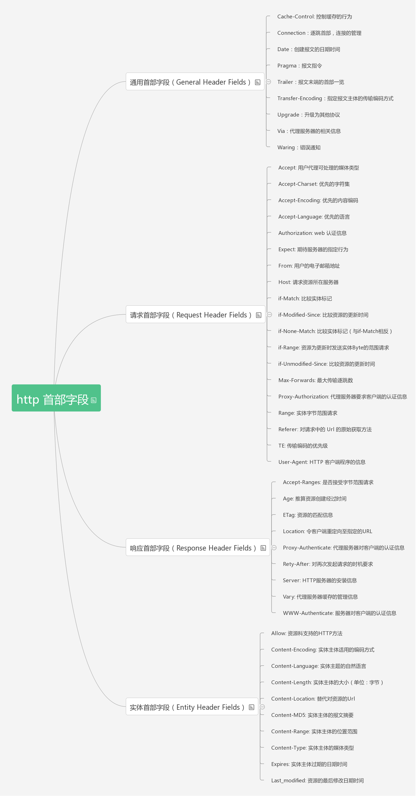

# Front-End-interview-questions
分享请标记出处: [https://github.com/petitspois/Front-End-interview-questions](https://github.com/petitspois/Front-End-interview-questions)

- [HTML部分](#HTML)
  - [DOCTYPE相关](#DOCTYPE相关)
  - [web语义化](#web语义化)
  - [前端SEO](#前端SEO)
  - [前端性能优化有哪些？](#前端性能优化有哪些？)
  - [web开发中会话跟踪的方法有哪些](#web开发中会话跟踪的方法有哪些)
  - [什么是HTML](#什么是HTML)
  - [XHTML和HTML有什么区别](#XHTML和HTML有什么区别)
  - [浏览器页面有哪三层构成，分别是什么，作用是什么?](#浏览器页面有哪三层构成，分别是什么，作用是什么?)


## HTML
### DOCTYPE相关

1. 告诉浏览器需要通过哪一种规范（文档类型定义，DTD）解析文档（比如HTML或XHTML规范)。
2. DTD（document type definition，文档类型定义）是一系列的语法规则，用来定义 XML 或 (X)HTML 的文件类型。浏览器会使用它来判断文档类型， 决定使用何种协议来解析，以及切换浏览器模式。
3. 浏览器模式: 3.1 标准模式、3.2 混杂模式。
    - 3.1 标准模式
      - 标准模式（standards mode）：浏览器根据W3C标准来渲染页面。
    - 3.2 混杂模式
      - 混杂模式（quirks mode）：浏览器采用更加宽松的、向后兼容的方式来渲染页面。

      - 混杂模式下，浏览器会模仿旧浏览器的行为，比如IE6，在此基础上兼容新的标准特性。 混杂模式又称兼容模式、怪异模式等。
4. 声明文档的解析类型(document.compatMode)，避免浏览器的怪异模式。
5. 如果你是使用最新标准编写的页面但未给出 DOCTYPE 声明，这时就可能会出现一些怪异的行为。但若你声明了\<!DOCTYPE html>，那么浏览器等同于进入了标准模式，并且按照W3C标准渲染页面。

### web语义化

- Web语义化是指使用恰当语义的html标签、class类名等内容，让页面具有良好的结构与含义，从而让人和机器都能快速理解网页内容。语义化的web页面一方面可以让机器在更少的人类干预情况下收集并研究网页的信息，从而可以读懂网页的内容，然后将收集汇总的信息进行分析，结果为人类所用；另一方面它可以让开发人员读懂结构和用户以及屏幕阅读器（如果访客有视障）能够读懂内容。
简单来说就是利于 SEO，便于阅读维护理解。
- 总结起来就是：
1. 正确的标签做正确的事情
2. 页面内容结构化
3. 无CSS样子时也容易阅读，便于阅读维护和理解
4. 便于浏览器、搜索引擎解析。 利于爬虫标记、利于SEO

- [拓展阅读](https://github.com/heweixiao/blog/issues/1)

### 前端SEO
 1. 合理的title、description、keywords：搜索对着三项的权重逐个减小，title值强调重点即可，重要关键词出现不要超过2次，而且要靠前，不同页面title要有所不同；description把页面内容高度概括，长度合适，不可过分堆砌关键词，不同页面description有所不同；keywords列举出重要关键词即可
 2. 语义化的HTML代码，符合W3C规范：语义化代码让搜索引擎容易理解网页
 3. 重要内容HTML代码放在最前：搜索引擎抓取HTML顺序是从上到下，有的搜索引擎对抓取长度有限制，保证重要内容一定会被抓取
 4. 重要内容不要用js输出：爬虫不会执行js获取内容
 5. 少用iframe：搜索引擎不会抓取iframe中的内容
 6. 非装饰性图片必须加alt
 7. 提高网站速度：网站速度是搜索引擎排序的一个重要指标
 
 ### 前端性能优化有哪些？
 1. 尽量减少 HTTP 请求个数——须权衡
 2. 使用 CDN（内容分发网络）
 3. 为文件头指定 Expires 或 Cache-Control ，使内容具有缓存性。
 4. 避免空的 src 和 href
 5. 使用 gzip 压缩内容
 6. 把 CSS 放到顶部
 7. 把 JS 放到底部
 8. 避免使用 CSS 表达式
 9. 将 CSS 和 JS 放到外部文件中
 10. 减少 DNS 查找次数
 11. 精简 CSS 和 JS
 12. 避免跳转
 13. 剔除重复的 JS 和 CSS
 14. 配置 ETags
 15. 使 AJAX 可缓存
 16. 尽早刷新输出缓冲
 17. 使用 GET 来完成 AJAX 请求
 18. 延迟加载
 19. 预加载
 20. 减少 DOM 元素个数
 21. 根据域名划分页面内容
 22. 尽量减少 iframe 的个数
 23. 避免 404 （合理使用404页面）
 24. 减少 Cookie 的大小
 25. 使用无 cookie 的域
 26. 减少 DOM 访问
 27. 开发智能事件处理程序
 28. 少用@import
 29. 避免使用滤镜
 30. 优化图像
 31. 优化 CSS Spirite或字体图标
 32. 不要在 HTML 中缩放图像——须权衡
 33. favicon.ico要小而且可缓存
 34. 保持单个内容小于25K
 35. 打包组件成复合文本

 - [拓展阅读](https://juejin.im/post/5b0bff30f265da08f76cc6f0)

 ### web开发中会话跟踪的方法有哪些
 1. cookie
 2. session
 3. url重写
 4. 隐藏input
 5. ip地址
### 什么是HTML
 - HTML：HyperText Markup Language超文本标记语言
### XHTML和HTML有什么区别
 - HTML是一种基本的WEB网页设计语言，XHTML是一个基于XML的标记语言
### 浏览器页面有哪三层构成，分别是什么，作用是什么?
 - 浏览器页面构成：结构层、表示层、行为层
 - 分别是：HTML、CSS、JavaScript
 - 作用：HTML实现页面结构，CSS完成页面的表现与风格，JavaScript实现一些客户端的功能与业务。
 ### 页面导入样式时，使用link和@import有什么区别
 1. 作用不同：link属于XHTML标签，除了加载CSS外，还能用于定义RSS, 定义rel连接属性等作用；而@import是CSS提供的，只能用于加载CSS;
 2. 加载不同：页面被加载的时，link会同时被加载，而@import引用的CSS会等到页面被加载完再加载;
 3. 兼容不同：import是CSS2.1 提出的，只在IE5以上才能被识别，而link是XHTML标签，无兼容问题;
 ### 网页制作会用到的图片格式有哪些？
 1. Webp：WebP格式，谷歌（google）开发的一种旨在加快图片加载速度的图片格式。并能节省大量的服务器带宽资源和数据空间。Facebook Ebay等知名网站已经开始测试并使用WebP格式。
 2. Apng：是PNG的位图动画扩展，可以实现png格式的动态图片效果，有望代替GIF成为下一代动态图标准。
 ### 文本标记
```
1.特殊字符
  1.&nbsp; 表示一个空格
  2.&lt; 表示一个<
  3.&gt; 表示一个>
  4.&copy; 表示版权
  5.&yen; ￥
2.文本样式
  1.<b></b> :加粗
  2.<i></i> :斜体
  3.<u></u> :下划线
  4.<s></s> :删除线
  5.<sup></sup> :上标
  6.<sub></sub> :下标
```

### 行内元素有哪些？块级元素有哪些？ 空(void)元素有那些？
1. 行内元素有：a b span img input select
2. 块级元素有: div p ul ol li dl dt dd h1-h6
3. 常见的空元素: br-换行，hr-水平分割线

### iframe有那些缺点
1. iframe会阻塞主页面的Onload事件，会影响页面的并行加载；
2. 搜索引擎的检索程序无法解读这种页面，不利于SEO;
- 通过javascript动态给iframe添加src属性值，这样可以绕开以上两个问题

### Label的作用是什么？
- label标签来定义表单控制间的关系,当用户选择该标签时，浏览器会自动将焦点转到和标签相关的表单控件上。
### 隐藏元素的几种方法
1. display:none;
2. visibility:hidden;
3. opacity:0;
4. position:absolute; left:-10000px;
### 简述一下src与href的区别
- src用于替换当前元素，href用于在当前文档和引用资源之间确立联系。
### 清除浮动的方法有哪些？
1. clear:both
   - 在父元素的里面添加一个空的clear的div（跟浮动的子级同级），然后再为这个类添加属性值clear:both;便可以清除浮动。
2. overflow：hidden
   - 在父元素的样式中添加overflow: hidden;也可以清除浮动，如下css代码，但不提倡使用这个方法，overflow: hidden;还有一个意思就是隐藏超出的部分，处理不好还是会给页面带来麻烦。
3. clearfix(推荐使用)
   1. 在父集元素类名中添加 clear-fix
   2. 写伪类样式
    ```
        .clearfix:after { 
            content: ".";     <----内容为“.”就是一个英文的句号而已。也可以不写。
            display: block;   <----加入的这个元素转换为块级元素。
            clear: both;     <----清除左右两边浮动。
            visibility: hidden;      <----可见度设为隐藏。注意它和display:none;是有区别的。仍然占据空间，只是看不到而已；
            height: 0;     <----高度为0；
            font-size:0;    <----字体大小为0；
        }
    ```
### HTTP方法
1. **GET**是最常用的方法，通常用于请求服务器发送某个资源。
2. **HEAD**与GET类似，但服务器在响应中只返回首部，不返回实体的主体部分
3. **PUT**让服务器用请求的主体部分来创建一个由所请求的URL命名的新文档，或者，如果那个URL已经存在的话，就用这个主体替代它
4. **POST**起初是用来向服务器输入数据的。实际上，通常会用它来支持HTML的表单。表单中填好的数据通常会被送给服务器，然后由服务器将其发送到要去的地方。
5. **TRACE**会在目的服务器端发起一个环回诊断，最后一站的服务器会弹回一个TRACE响应并在响应主体中携带它收到的原始请求报文。TRACE方法主要用于诊断，用于验证请求是否如愿穿过了请求/响应链。
6. **OPTIONS**方法请求web服务器告知其支持的各种功能。可以查询服务器支持哪些方法或者对某些特殊资源支持哪些方法。
7. **DELETE**请求服务器删除请求URL指定的资源

### HTTP 报文结构
 - HTTP 报文有 请求报文 和 响应报文 两种。
 - 请求报文：从客户向服务器发送请求报文。
 - 响应报文：从服务端到客户的回答。
 - 由于 HTTP 是面向文本的，因此在报文中的每一个字段都是一些 ASCII 码串，因此各个字段的长度是不确定的。
这也造成了 HTTP 报文结构的统一性，不然无法解析出数据。
 - HTTP的这两种报文都由三部分组成：开始行、首部行、实体主体。
 1. 开始行
    - 区分请求报文与响应报文
    #### 请求报文的开始行:
    >也叫请求行，由 **方法**、[空格]、**URL**、[空格]、**HTTP**版本 组成。

    1. 方法： 向请求资源指定的资源发送请求报文的方法，其作用是可以指定请求的资源按期望产生某种行为。
    2. URL: 链接
    3. HTTP版本：目前有 HTTP/1.0、HTTP/1.1、HTTP/2.0 版本，其中 HTTP1.0 版本使用较广泛。

    #### 响应报文的开始行:
    > 也叫响应行，由 HTTP 版本、[空格]、状态码组成。

    - 状态码（Status-Code）都是三位数字的，分为 5 大类共 33 种。
    
    状态码 | 说明 | 请求行例子
    -|:-:| -
    1xx | 表示通知信息的，如请求收到了或正在进行处理|  
    2xx | 表示成功 | HTTP/1.1 200 OK
    3xx | 表示重定向
    4xx | 表示客户端的差错，如请求链接为不存在 | HTTP/1.1 404 Not Found
    5xx | 表示服务器的差错

    #### 首部行

    1. 是用来说明浏览器、服务器或报文主体的一些信息。
    2. 可以有好几行，也可以不使用
    3. 每个首部行都是由 首部字段名、[空格] 和 值 组成
    4. 每个首部行在结束地方都有 CRLF（『回车』和『换行』符）
    > HTTP 首部字段分为 4 种： 通用首部字段、请求首部字段、响应首部字段、实体首部字段。

    

    

