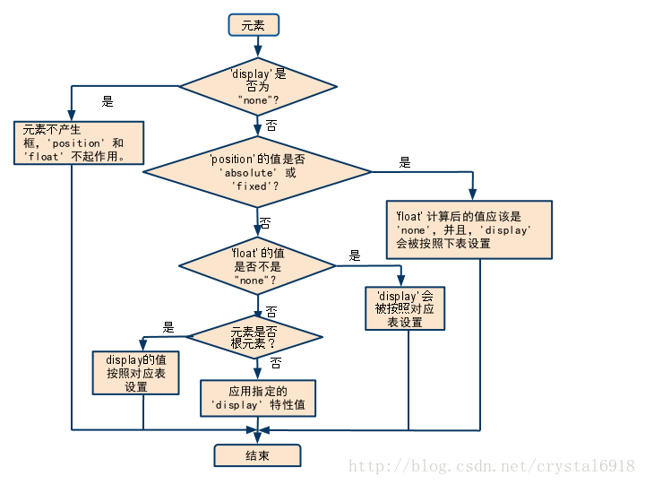
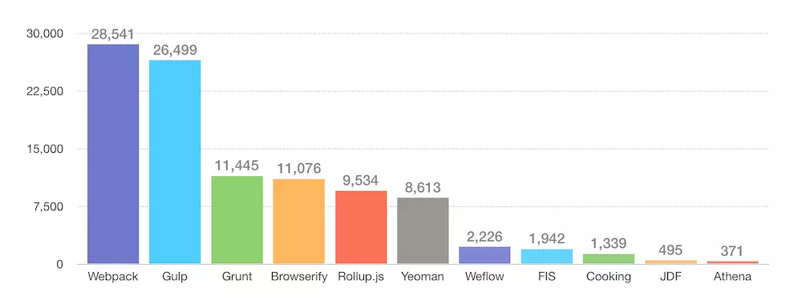
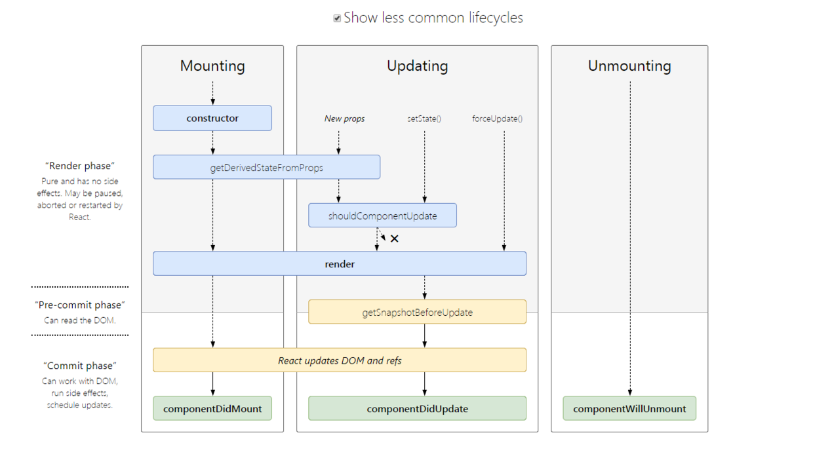

# 1. Front-End-interview-questions
分享请标记出处: [https://github.com/petitspois/Front-End-interview-questions](https://github.com/petitspois/Front-End-interview-questions)

<!-- TOC -->

- [1. Front-End-interview-questions](#1-front-end-interview-questions)
    - [1.1. HTML](#11-html)
        - [1.1.1. DOCTYPE相关](#111-doctype相关)
        - [1.1.2. web语义化](#112-web语义化)
        - [1.1.3. 前端SEO](#113-前端seo)
        - [1.1.4. 前端性能优化有哪些](#114-前端性能优化有哪些)
        - [1.1.5. web开发中会话跟踪的方法有哪些](#115-web开发中会话跟踪的方法有哪些)
        - [1.1.6. 什么是HTML](#116-什么是html)
        - [1.1.7. XHTML和HTML有什么区别](#117-xhtml和html有什么区别)
        - [1.1.8. 浏览器页面有哪三层构成，分别是什么，作用是什么](#118-浏览器页面有哪三层构成分别是什么作用是什么)
        - [1.1.9. 页面导入样式时，使用link和\@import有什么区别](#119-页面导入样式时使用link和\import有什么区别)
        - [1.1.10. 网页制作会用到的图片格式有哪些](#1110-网页制作会用到的图片格式有哪些)
        - [1.1.11. 文本标记](#1111-文本标记)
        - [1.1.12. 行内元素、块级元素、空(void)元素，有那些](#1112-行内元素块级元素空void元素有那些)
        - [1.1.13. iframe有那些缺点](#1113-iframe有那些缺点)
        - [1.1.14. Label的作用是什么？](#1114-label的作用是什么)
        - [1.1.15. 隐藏元素的几种方法](#1115-隐藏元素的几种方法)
        - [1.1.16. 简述一下src与href的区别](#1116-简述一下src与href的区别)
        - [1.1.17. 清除浮动的方法有哪些](#1117-清除浮动的方法有哪些)
        - [1.1.18. HTTP方法](#1118-http方法)
        - [1.1.19. HTTP报文结构](#1119-http报文结构)
        - [1.1.20. HTML全局属性global-attribute有哪些](#1120-html全局属性global-attribute有哪些)
        - [1.1.21. 何为渐进增强、优雅降级](#1121-何为渐进增强优雅降级)
        - [1.1.22. \的title和alt有什么区别](#1122-\img的title和alt有什么区别)
        - [1.1.23. 从浏览器地址栏输入url到显示页面的步骤(以HTTP为例)](#1123-从浏览器地址栏输入url到显示页面的步骤以http为例)
        - [1.1.24. HTML5新增元素、标签](#1124-html5新增元素标签)
            - [1.1.24.1. form相关](#11241-form相关)
            - [1.1.24.2. 增强的页面元素](#11242-增强的页面元素)
    - [1.2. CSS部分](#12-css部分)
        - [1.2.1. CSS选择器有哪些](#121-css选择器有哪些)
            - [1.2.1.1. 基本选择器](#1211-基本选择器)
            - [1.2.1.2. 多元素的组合选择器](#1212-多元素的组合选择器)
            - [1.2.1.3. CSS 2.1 属性选择器](#1213-css-21-属性选择器)
            - [1.2.1.4. CSS 2.1中的伪类](#1214-css-21中的伪类)
            - [1.2.1.5. CSS 2.1中的伪元素](#1215-css-21中的伪元素)
            - [1.2.1.6. CSS 3的同级元素通用选择器](#1216-css-3的同级元素通用选择器)
            - [1.2.1.7. CSS 3 属性选择器](#1217-css-3-属性选择器)
            - [1.2.1.8. CSS 3中与用户界面有关的伪类](#1218-css-3中与用户界面有关的伪类)
            - [1.2.1.9. CSS 3中的结构性伪类](#1219-css-3中的结构性伪类)
            - [1.2.1.10. CSS 3的反选伪类](#12110-css-3的反选伪类)
            - [1.2.1.11. CSS 3中的 :target 伪类](#12111-css-3中的-target-伪类)
        - [1.2.2. display: none;与visibility: hidden;的区别](#122-display-none与visibility-hidden的区别)
        - [1.2.3. css sprite是什么,有什么优缺点](#123-css-sprite是什么有什么优缺点)
        - [1.2.4. CSS盒模型有那几种？](#124-css盒模型有那几种)
        - [1.2.5. CSS有哪些继承属性](#125-css有哪些继承属性)
        - [1.2.6. png、jpg、gif 这些图片格式解释一下，分别什么时候用。有没有了解过webp？](#126-pngjpggif-这些图片格式解释一下分别什么时候用有没有了解过webp)
        - [1.2.7. float、position 和 display 之间的关系](#127-floatposition-和-display-之间的关系)
        - [1.2.8. 超链接访问过后hover样式就不出现的问题？](#128-超链接访问过后hover样式就不出现的问题)
        - [1.2.9. box-sizing属性？](#129-box-sizing属性)
        - [1.2.10. CSS优先级算法如何计算？](#1210-css优先级算法如何计算)
        - [1.2.11. CSS3有哪些新特性？](#1211-css3有哪些新特性)
        - [1.2.12. 请解释一下CSS3的flexbox（弹性盒布局模型）,以及适用场景？](#1212-请解释一下css3的flexbox弹性盒布局模型以及适用场景)
        - [1.2.13. 为什么要初始化CSS样式](#1213-为什么要初始化css样式)
        - [1.2.14. 对BFC规范(块级格式化上下文：block formatting context)的理解？](#1214-对bfc规范块级格式化上下文block-formatting-context的理解)
        - [1.2.15. 为什么会出现浮动和什么时候需要清除浮动？清除浮动的方式？](#1215-为什么会出现浮动和什么时候需要清除浮动清除浮动的方式)
        - [1.2.16. 上下margin重合的问题](#1216-上下margin重合的问题)
        - [1.2.17. 移动端的布局用过媒体查询吗？](#1217-移动端的布局用过媒体查询吗)
        - [1.2.18. CSS优化、提高性能的方法有哪些？](#1218-css优化提高性能的方法有哪些)
        - [1.2.19. 浏览器是怎样解析CSS选择器的？](#1219-浏览器是怎样解析css选择器的)
        - [1.2.20. 在网页中的应该使用奇数还是偶数的字体？为什么呢？](#1220-在网页中的应该使用奇数还是偶数的字体为什么呢)
        - [1.2.21. margin和padding分别适合什么场景使用？](#1221-margin和padding分别适合什么场景使用)
        - [1.2.22. 元素竖向的百分比设定是相对于容器的高度吗？](#1222-元素竖向的百分比设定是相对于容器的高度吗)
        - [1.2.23. 如果需要手动写动画，你认为最小时间间隔是多久，为什么？](#1223-如果需要手动写动画你认为最小时间间隔是多久为什么)
        - [1.2.24. style标签写在body后与body前有什么区别？](#1224-style标签写在body后与body前有什么区别)
        - [1.2.25. 如何垂直居中一个元素](#1225-如何垂直居中一个元素)
            - [1.2.25.1. 文字的垂直居中](#12251-文字的垂直居中)
            - [1.2.25.2. 容器的垂直居中](#12252-容器的垂直居中)
    - [1.3. Js概念部分](#13-js概念部分)
        - [1.3.1. javascript有哪几种数据类型](#131-javascript有哪几种数据类型)
        - [1.3.2. 什么是闭包](#132-什么是闭包)
            - [1.3.2.1. 闭包的概念](#1321-闭包的概念)
            - [1.3.2.2. 闭包的用途](#1322-闭包的用途)
            - [1.3.2.3. 闭包的注意点](#1323-闭包的注意点)
            - [1.3.2.4. XMLHttpRequest通用属性和方法](#1324-xmlhttprequest通用属性和方法)
        - [1.3.3. Fetch相比Ajax有什么优势？](#133-fetch相比ajax有什么优势)
        - [1.3.4. sessionStorage,localStorage,cookie区别](#134-sessionstoragelocalstoragecookie区别)
        - [1.3.5. javascript跨域通信](#135-javascript跨域通信)
            - [1.3.5.1. 同源：两个文档同源需满足](#1351-同源两个文档同源需满足)
            - [1.3.5.2. 跨域通信：js进行DOM操作、通信时如果目标与当前窗口不满足同源条件，浏览器为了安全会阻止跨域操作。跨域通信通常有以下方法](#1352-跨域通信js进行dom操作通信时如果目标与当前窗口不满足同源条件浏览器为了安全会阻止跨域操作跨域通信通常有以下方法)
        - [1.3.6. javascript有哪几种方法定义函数](#136-javascript有哪几种方法定义函数)
        - [1.3.7. javascript有哪些方法定义对象](#137-javascript有哪些方法定义对象)
        - [1.3.8. JavaScript 中 undefined 和 not defined 的区别](#138-javascript-中-undefined-和-not-defined-的区别)
        - [1.3.9. 怎么判断一个object是否是数组(array)？](#139-怎么判断一个object是否是数组array)
        - [1.3.10. 栈和堆的区别？](#1310-栈和堆的区别)
        - [1.3.11. 谈谈this的理解](#1311-谈谈this的理解)
        - [1.3.12. eval是做什么的？](#1312-eval是做什么的)
        - [1.3.13. 什么是window对象? 什么是document对象?](#1313-什么是window对象-什么是document对象)
        - [1.3.14. null，undefined的区别？](#1314-nullundefined的区别)
        - [1.3.15. javascript 代码中的"use strict";是什么意思 ? 使用它区别是什么？](#1315-javascript-代码中的use-strict是什么意思--使用它区别是什么)
        - [1.3.16. 如何判断一个对象是否属于某个类？](#1316-如何判断一个对象是否属于某个类)
        - [1.3.17. new操作符具体干了什么呢?](#1317-new操作符具体干了什么呢)
        - [1.3.18. Javascript中，执行时对象查找时，永远不会去查找原型的函数？](#1318-javascript中执行时对象查找时永远不会去查找原型的函数)
        - [1.3.19. JS延迟加载的方式有哪些？](#1319-js延迟加载的方式有哪些)
        - [1.3.20. AMD（Modules/Asynchronous-Definition）、CMD（Common Module Definition）规范区别？](#1320-amdmodulesasynchronous-definitioncmdcommon-module-definition规范区别)
        - [1.3.21. call和apply](#1321-call和apply)
        - [1.3.22. documen.write和 innerHTML的区别](#1322-documenwrite和-innerhtml的区别)
        - [1.3.23. 回流与重绘](#1323-回流与重绘)
        - [1.3.24. 数组对象有哪些原生方法，列举一下](#1324-数组对象有哪些原生方法列举一下)
        - [1.3.25. 那些操作会造成内存泄漏](#1325-那些操作会造成内存泄漏)
        - [1.3.26. flash和js通过什么类如何交互?](#1326-flash和js通过什么类如何交互)
        - [1.3.27. 有效的javascript变量定义规则](#1327-有效的javascript变量定义规则)
        - [1.3.28. XML与JSON的区别？](#1328-xml与json的区别)
        - [1.3.29. Web Worker和Web Socket？](#1329-web-worker和web-socket)
        - [1.3.30. JS垃圾回收机制？](#1330-js垃圾回收机制)
        - [1.3.31. web应用从服务器主动推送data到客户端的方式？](#1331-web应用从服务器主动推送data到客户端的方式)
        - [1.3.32. attribute与property的区别？](#1332-attribute与property的区别)
    - [1.4. javascript编程部分](#14-javascript编程部分)
        - [1.4.1. 如何判断一个对象是否为函数](#141-如何判断一个对象是否为函数)
        - [1.4.2. 下面的代码输出什么？](#142-下面的代码输出什么)
        - [1.4.3. 写一个mul函数，使用方法如下。](#143-写一个mul函数使用方法如下)
        - [1.4.4. JavaScript怎么清空数组？](#144-javascript怎么清空数组)
        - [1.4.5. 下面代码输出什么(delete)？](#145-下面代码输出什么delete)
        - [1.4.6. 实现对数组进行乱序](#146-实现对数组进行乱序)
        - [1.4.7. 实现一个函数 clone()，可以对 JavaScript 中的5种主要的数据类型（包括 Number、String、Object、Array、Boolean）进行值复制。](#147-实现一个函数-clone可以对-javascript-中的5种主要的数据类型包括-numberstringobjectarrayboolean进行值复制)
        - [1.4.8. [] ? !![] : ![];输出结果是什么？](#148-----输出结果是什么)
        - [1.4.9. 下面代码输出什么？](#149-下面代码输出什么)
        - [1.4.10. 下面的代码会在 console 输出神马？为什么？](#1410-下面的代码会在-console-输出神马为什么)
        - [1.4.11. 下面的代码会在 console 输出神马？为什么？](#1411-下面的代码会在-console-输出神马为什么)
        - [1.4.12. 解释一下下面代码的输出](#1412-解释一下下面代码的输出)
        - [1.4.13. 实现函数 isInteger(x) 来判断 x 是否是整数](#1413-实现函数-isintegerx-来判断-x-是否是整数)
        - [1.4.14. 在下面的代码中，数字 1-4 会以什么顺序输出？为什么会这样输出？](#1414-在下面的代码中数字-1-4-会以什么顺序输出为什么会这样输出)
        - [1.4.15. 写一个按照下面方式调用都能正常工作的 sum 方法](#1415-写一个按照下面方式调用都能正常工作的-sum-方法)
        - [1.4.16. 解释下面代码的输出](#1416-解释下面代码的输出)
        - [1.4.17. 给你一个 DOM 元素，创建一个能访问该元素所有子元素的函数，并且要将每个子元素传递给指定的回调函数。](#1417-给你一个-dom-元素创建一个能访问该元素所有子元素的函数并且要将每个子元素传递给指定的回调函数)
        - [1.4.18. Js数组去重方法](#1418-js数组去重方法)
        - [1.4.19. 二维数组的冒泡排序](#1419-二维数组的冒泡排序)
    - [1.5. ES全称ECMAScript: ES6 ES7 ES8, 以下均为es6解答](#15-es全称ecmascript-es6-es7-es8-以下均为es6解答)
        - [1.5.1. 在项目中你经常用到那些es6新特性？](#151-在项目中你经常用到那些es6新特性)
        - [1.5.2. JavaScript 中的 let 关键字有什么用？](#152-javascript-中的-let-关键字有什么用)
        - [1.5.3. 如何检查一个数字是否为整数？](#153-如何检查一个数字是否为整数)
        - [1.5.4. 可以讲一下异步流的发展?](#154-可以讲一下异步流的发展)
        - [1.5.5. 去除浮点数，保留整数部分](#155-去除浮点数保留整数部分)
        - [1.5.6. 使用解构赋值，实现两个变量的值的交换（编程题）](#156-使用解构赋值实现两个变量的值的交换编程题)
        - [1.5.7. 使用解构赋值，完成函数的参数默认值（编程题）](#157-使用解构赋值完成函数的参数默认值编程题)
        - [1.5.8. 利用数组推导，计算出数组 [1,2,3,4] 每一个元素的平方并组成新的数组。](#158-利用数组推导计算出数组-1234-每一个元素的平方并组成新的数组)
        - [1.5.9. 使用模板字符串改写下面的代码。（ES5 to ES6改写题）](#159-使用模板字符串改写下面的代码es5-to-es6改写题)
        - [1.5.10. 设计一个对象，键名的类型至少包含一个symbol类型，并且实现遍历所有key。（编程题）](#1510-设计一个对象键名的类型至少包含一个symbol类型并且实现遍历所有key编程题)
        - [1.5.11. 有一本书的属性为：{“name”:“《ES6基础系列》”, ”price”：56 }；要求使用Proxy对象对其进行拦截处理，name属性对外为“《ES6入门到懵逼》”,price属性为只读。](#1511-有一本书的属性为namees6基础系列-price56-要求使用proxy对象对其进行拦截处理name属性对外为es6入门到懵逼price属性为只读)
        - [1.5.12. 阅读下面的代码，并用for...of改成它。（ES5 to ES6改写题）](#1512-阅读下面的代码并用forof改成它es5-to-es6改写题)
        - [1.5.13. 关于Set结构，阅读下面的代码，回答问题。](#1513-关于set结构阅读下面的代码回答问题)
        - [1.5.14. 关于Map结构，阅读下面的代码，回答问题。](#1514-关于map结构阅读下面的代码回答问题)
        - [1.5.15. 箭头函数需要注意的地方](#1515-箭头函数需要注意的地方)
        - [1.5.16. promise对象的用法,手写一个promise](#1516-promise对象的用法手写一个promise)
        - [1.5.17. 把以下代码使用两种方法，来依次输出0到9？](#1517-把以下代码使用两种方法来依次输出0到9)
        - [1.5.18. ES6的模板字符串有哪些新特性？](#1518-es6的模板字符串有哪些新特性)
        - [1.5.19. 数组扩展的fill( )函数，[1,2,3].fill(4)的结果是](#1519-数组扩展的fill-函数123fill4的结果是)
        - [1.5.20. 判断两个值是否严格相等](#1520-判断两个值是否严格相等)
    - [1.6. 构建工具](#16-构建工具)
        - [1.6.1. 什么是前端工程化](#161-什么是前端工程化)
        - [1.6.2. 为什么要前端工程化](#162-为什么要前端工程化)
        - [1.6.3. 构建工具选型](#163-构建工具选型)
        - [1.6.4. Webpack 优缺点](#164-webpack-优缺点)
        - [1.6.5. Rollup](#165-rollup)
        - [1.6.6. Gulp与Webpack的区别](#166-gulp与webpack的区别)
        - [1.6.7. 与webpack类似的工具还有哪些？谈谈你为什么最终选择（或放弃）使用webpack？](#167-与webpack类似的工具还有哪些谈谈你为什么最终选择或放弃使用webpack)
        - [1.6.8. 有哪些常见的Loader？他们是解决什么问题的？](#168-有哪些常见的loader他们是解决什么问题的)
        - [1.6.9. 有哪些常见的Plugin？他们是解决什么问题的？](#169-有哪些常见的plugin他们是解决什么问题的)
        - [1.6.10. Loader和Plugin的不同？](#1610-loader和plugin的不同)
        - [1.6.11. webpack的构建流程是什么?从读取配置到输出文件这个过程尽量说全](#1611-webpack的构建流程是什么从读取配置到输出文件这个过程尽量说全)
        - [1.6.12. 是否写过Loader和Plugin？描述一下编写loader或plugin的思路？](#1612-是否写过loader和plugin描述一下编写loader或plugin的思路)
        - [1.6.13. webpack的热更新是如何做到的？说明其原理？](#1613-webpack的热更新是如何做到的说明其原理)
        - [1.6.14. 如何利用webpack来优化前端性能？](#1614-如何利用webpack来优化前端性能)
        - [1.6.15. 如何提高webpack的构建速度？](#1615-如何提高webpack的构建速度)
    - [1.7. 单元测试](#17-单元测试)
        - [1.7.1. 单元测试的意义](#171-单元测试的意义)
        - [1.7.2. 为什么需要单元测试](#172-为什么需要单元测试)
        - [1.7.3. 两个常用的单元测试方法论](#173-两个常用的单元测试方法论)
        - [1.7.4. 都用过那些测试框架](#174-都用过那些测试框架)
        - [1.7.5. 常用的断言库](#175-常用的断言库)
    - [1.8. React 常见问题](#18-react-常见问题)
        - [1.8.1. React 中 keys 的作用是什么？](#181-react-中-keys-的作用是什么)
        - [1.8.2. 调用 setState 之后发生了什么？](#182-调用-setstate-之后发生了什么)
        - [1.8.3. react 生命周期函数](#183-react-生命周期函数)
        - [1.8.4. shouldComponentUpdate 是做什么的](#184-shouldcomponentupdate-是做什么的)
        - [1.8.5. 为什么虚拟 dom 会提高性能?](#185-为什么虚拟-dom-会提高性能)
        - [1.8.6. react diff 原理](#186-react-diff-原理)
        - [1.8.7. React 中 refs 的作用是什么？](#187-react-中-refs-的作用是什么)
        - [1.8.8. (组件的)状态(state)和属性(props)之间有何不同](#188-组件的状态state和属性props之间有何不同)
        - [1.8.9. 何为受控组件(controlled component)](#189-何为受控组件controlled-component)
        - [1.8.10. 为什么建议传递给 setState 的参数是一个 callback 而不是一个对象](#1810-为什么建议传递给-setstate-的参数是一个-callback-而不是一个对象)
        - [1.8.11. 除了在构造函数中绑定 this，还有其它方式吗](#1811-除了在构造函数中绑定-this还有其它方式吗)
        - [1.8.12. 应该在 React 组件的何处发起 Ajax 请求](#1812-应该在-react-组件的何处发起-ajax-请求)
        - [1.8.13. 描述事件在 React 中的处理方式](#1813-描述事件在-react-中的处理方式)
        - [1.8.14. createElement 和 cloneElement 有什么区别？](#1814-createelement-和-cloneelement-有什么区别)
        - [1.8.15. React 中有三种构建组件的方式](#1815-react-中有三种构建组件的方式)
        - [1.8.16. React 项目用过什么脚手架](#1816-react-项目用过什么脚手架)
        - [1.8.17. 怎么用 React.createElement 重写下面的代码](#1817-怎么用-reactcreateelement-重写下面的代码)
        - [1.8.18. 如何告诉 React 它应该编译生产环境版本？](#1818-如何告诉-react-它应该编译生产环境版本)
    - [1.9. 开放性问题](#19-开放性问题)

<!-- /TOC -->


## 1.1. HTML
### 1.1.1. DOCTYPE相关

1. 告诉浏览器需要通过哪一种规范（文档类型定义，DTD）解析文档（比如HTML或XHTML规范)。
2. DTD（document type definition，文档类型定义）是一系列的语法规则，用来定义 XML 或 (X)HTML 的文件类型。浏览器会使用它来判断文档类型， 决定使用何种协议来解析，以及切换浏览器模式。
3. 浏览器模式: 3.1 标准模式、3.2 混杂模式。
    - 3.1 标准模式
      - 标准模式（standards mode）：浏览器根据W3C标准来渲染页面。
    - 3.2 混杂模式
      - 混杂模式（quirks mode）：浏览器采用更加宽松的、向后兼容的方式来渲染页面。

      - 混杂模式下，浏览器会模仿旧浏览器的行为，比如IE6，在此基础上兼容新的标准特性。 混杂模式又称兼容模式、怪异模式等。
4. 声明文档的解析类型(document.compatMode)，避免浏览器的怪异模式。
5. 如果你是使用最新标准编写的页面但未给出 DOCTYPE 声明，这时就可能会出现一些怪异的行为。但若你声明了\<!DOCTYPE html>，那么浏览器等同于进入了标准模式，并且按照W3C标准渲染页面。

### 1.1.2. web语义化

- Web语义化是指使用恰当语义的html标签、class类名等内容，让页面具有良好的结构与含义，从而让人和机器都能快速理解网页内容。语义化的web页面一方面可以让机器在更少的人类干预情况下收集并研究网页的信息，从而可以读懂网页的内容，然后将收集汇总的信息进行分析，结果为人类所用；另一方面它可以让开发人员读懂结构和用户以及屏幕阅读器（如果访客有视障）能够读懂内容。
简单来说就是利于 SEO，便于阅读维护理解。
- 总结起来就是：
1. 正确的标签做正确的事情
2. 页面内容结构化
3. 无CSS样子时也容易阅读，便于阅读维护和理解
4. 便于浏览器、搜索引擎解析。 利于爬虫标记、利于SEO

- [拓展阅读](https://github.com/heweixiao/blog/issues/1)

### 1.1.3. 前端SEO

 1. 合理的title、description、keywords：搜索对着三项的权重逐个减小，title值强调重点即可，重要关键词出现不要超过2次，而且要靠前，不同页面title要有所不同；description把页面内容高度概括，长度合适，不可过分堆砌关键词，不同页面description有所不同；keywords列举出重要关键词即可
 2. 语义化的HTML代码，符合W3C规范：语义化代码让搜索引擎容易理解网页
 3. 重要内容HTML代码放在最前：搜索引擎抓取HTML顺序是从上到下，有的搜索引擎对抓取长度有限制，保证重要内容一定会被抓取
 4. 重要内容不要用js输出：爬虫不会执行js获取内容
 5. 少用iframe：搜索引擎不会抓取iframe中的内容
 6. 非装饰性图片必须加alt
 7. 提高网站速度：网站速度是搜索引擎排序的一个重要指标
 
### 1.1.4. 前端性能优化有哪些
 
 1. 尽量减少 HTTP 请求个数——须权衡
 2. 使用 CDN（内容分发网络）
 3. 为文件头指定 Expires 或 Cache-Control ，使内容具有缓存性。
 4. 避免空的 src 和 href
 5. 使用 gzip 压缩内容
 6. 把 CSS 放到顶部
 7. 把 JS 放到底部
 8. 避免使用 CSS 表达式
 9. 将 CSS 和 JS 放到外部文件中
 10. 减少 DNS 查找次数
 11. 精简 CSS 和 JS
 12. 避免跳转
 13. 剔除重复的 JS 和 CSS
 14. 配置 ETags
 15. 使 AJAX 可缓存
 16. 尽早刷新输出缓冲
 17. 使用 GET 来完成 AJAX 请求
 18. 延迟加载
 19. 预加载
 20. 减少 DOM 元素个数
 21. 根据域名划分页面内容
 22. 尽量减少 iframe 的个数
 23. 避免 404 （合理使用404页面）
 24. 减少 Cookie 的大小
 25. 使用无 cookie 的域
 26. 减少 DOM 访问
 27. 开发智能事件处理程序
 28. 少用@import
 29. 避免使用滤镜
 30. 优化图像
 31. 优化 CSS Spirite或字体图标
 32. 不要在 HTML 中缩放图像——须权衡
 33. favicon.ico要小而且可缓存
 34. 保持单个内容小于25K
 35. 打包组件成复合文本

 - [拓展阅读](https://juejin.im/post/5b0bff30f265da08f76cc6f0)

### 1.1.5. web开发中会话跟踪的方法有哪些
 
 1. cookie
 2. session
 3. url重写
 4. 隐藏input
 5. ip地址
 
### 1.1.6. 什么是HTML
 - HTML：HyperText Markup Language超文本标记语言
 
### 1.1.7. XHTML和HTML有什么区别
 - HTML是一种基本的WEB网页设计语言，XHTML是一个基于XML的标记语言
 
### 1.1.8. 浏览器页面有哪三层构成，分别是什么，作用是什么
 - 浏览器页面构成：结构层、表示层、行为层
 - 分别是：HTML、CSS、JavaScript
 - 作用：HTML实现页面结构，CSS完成页面的表现与风格，JavaScript实现一些客户端的功能与业务。
 
### 1.1.9. 页面导入样式时，使用link和\@import有什么区别
 1. 作用不同：link属于XHTML标签，除了加载CSS外，还能用于定义RSS, 定义rel连接属性等作用；而\@import是CSS提供的，只能用于加载CSS;
 2. 加载不同：页面被加载的时，link会同时被加载，而\@import引用的CSS会等到页面被加载完再加载;
 3. 兼容不同：import是CSS2.1 提出的，只在IE5以上才能被识别，而link是XHTML标签，无兼容问题;
 
### 1.1.10. 网页制作会用到的图片格式有哪些
 1. Webp：WebP格式，谷歌（google）开发的一种旨在加快图片加载速度的图片格式。并能节省大量的服务器带宽资源和数据空间。Facebook Ebay等知名网站已经开始测试并使用WebP格式。
 2. Apng：是PNG的位图动画扩展，可以实现png格式的动态图片效果，有望代替GIF成为下一代动态图标准。
 

### 1.1.11. 文本标记
```
1.特殊字符
  1.&nbsp; 表示一个空格
  2.&lt; 表示一个<
  3.&gt; 表示一个>
  4.&copy; 表示版权
  5.&yen; ￥
2.文本样式
  1.<b></b> :加粗
  2.<i></i> :斜体
  3.<u></u> :下划线
  4.<s></s> :删除线
  5.<sup></sup> :上标
  6.<sub></sub> :下标
```

### 1.1.12. 行内元素、块级元素、空(void)元素，有那些
1. 行内元素有：a b span img input select
2. 块级元素有: div p ul ol li dl dt dd h1-h6
3. 常见的空元素: br-换行，hr-水平分割线

### 1.1.13. iframe有那些缺点
1. iframe会阻塞主页面的Onload事件，会影响页面的并行加载；
2. 搜索引擎的检索程序无法解读这种页面，不利于SEO;
- 通过javascript动态给iframe添加src属性值，这样可以绕开以上两个问题

### 1.1.14. Label的作用是什么？
- label标签来定义表单控制间的关系,当用户选择该标签时，浏览器会自动将焦点转到和标签相关的表单控件上。

### 1.1.15. 隐藏元素的几种方法
1. display:none;
2. visibility:hidden;
3. opacity:0;
4. position:absolute; left:-10000px;

### 1.1.16. 简述一下src与href的区别
- src用于替换当前元素，href用于在当前文档和引用资源之间确立联系。

### 1.1.17. 清除浮动的方法有哪些
1. clear:both
   - 在父元素的里面添加一个空的clear的div（跟浮动的子级同级），然后再为这个类添加属性值clear:both;便可以清除浮动。
2. overflow：hidden
   - 在父元素的样式中添加overflow: hidden;也可以清除浮动，如下css代码，但不提倡使用这个方法，overflow: hidden;还有一个意思就是隐藏超出的部分，处理不好还是会给页面带来麻烦。
3. clearfix(推荐使用)
   1. 在父集元素类名中添加 clear-fix
   2. 写伪类样式
    ```
        .clearfix:after { 
            content: ".";     <----内容为“.”就是一个英文的句号而已。也可以不写。
            display: block;   <----加入的这个元素转换为块级元素。
            clear: both;     <----清除左右两边浮动。
            visibility: hidden;      <----可见度设为隐藏。注意它和display:none;是有区别的。仍然占据空间，只是看不到而已；
            height: 0;     <----高度为0；
            font-size:0;    <----字体大小为0；
        }
    ```
    
### 1.1.18. HTTP方法
1. **GET**是最常用的方法，通常用于请求服务器发送某个资源。
2. **HEAD**与GET类似，但服务器在响应中只返回首部，不返回实体的主体部分
3. **PUT**让服务器用请求的主体部分来创建一个由所请求的URL命名的新文档，或者，如果那个URL已经存在的话，就用这个主体替代它
4. **POST**起初是用来向服务器输入数据的。实际上，通常会用它来支持HTML的表单。表单中填好的数据通常会被送给服务器，然后由服务器将其发送到要去的地方。
5. **TRACE**会在目的服务器端发起一个环回诊断，最后一站的服务器会弹回一个TRACE响应并在响应主体中携带它收到的原始请求报文。TRACE方法主要用于诊断，用于验证请求是否如愿穿过了请求/响应链。
6. **OPTIONS**方法请求web服务器告知其支持的各种功能。可以查询服务器支持哪些方法或者对某些特殊资源支持哪些方法。
7. **DELETE**请求服务器删除请求URL指定的资源

### 1.1.19. HTTP报文结构
 - HTTP 报文有 请求报文 和 响应报文 两种。
 - 请求报文：从客户向服务器发送请求报文。
 - 响应报文：从服务端到客户的回答。
 - 由于 HTTP 是面向文本的，因此在报文中的每一个字段都是一些 ASCII 码串，因此各个字段的长度是不确定的。
这也造成了 HTTP 报文结构的统一性，不然无法解析出数据。
 - HTTP的这两种报文都由三部分组成：开始行、首部行、实体主体。
 1. 开始行
    - 区分请求报文与响应报文
    #### 请求报文的开始行:
    >也叫请求行，由 **方法**、[空格]、**URL**、[空格]、**HTTP**版本 组成。

    1. 方法： 向请求资源指定的资源发送请求报文的方法，其作用是可以指定请求的资源按期望产生某种行为。
    2. URL: 链接
    3. HTTP版本：目前有 HTTP/1.0、HTTP/1.1、HTTP/2.0 版本，其中 HTTP1.0 版本使用较广泛。

    #### 响应报文的开始行:
    > 也叫响应行，由 HTTP 版本、[空格]、状态码组成。

    - 状态码（Status-Code）都是三位数字的，分为 5 大类共 33 种。
    
    状态码 | 说明 | 请求行例子
    -|:-:| -
    1xx | 表示通知信息的，如请求收到了或正在进行处理|  
    2xx | 表示成功 | HTTP/1.1 200 OK
    3xx | 表示重定向
    4xx | 表示客户端的差错，如请求链接为不存在 | HTTP/1.1 404 Not Found
    5xx | 表示服务器的差错

    #### 首部行

    1. 是用来说明浏览器、服务器或报文主体的一些信息。
    2. 可以有好几行，也可以不使用
    3. 每个首部行都是由 首部字段名、[空格] 和 值 组成
    4. 每个首部行在结束地方都有 CRLF（『回车』和『换行』符）
    > HTTP 首部字段分为 4 种： 通用首部字段、请求首部字段、响应首部字段、实体首部字段。

    

    #### 实体主体

    - 在请求报文中，一般是 post/put 提交的表单信息。与首部行之间有 CRLF 即空行。

### 1.1.20. HTML全局属性global-attribute有哪些

1. accesskey:设置快捷键，提供快速访问元素如aaa在windows下的firefox中按alt + shift + a可激活元素
2. class:为元素设置类标识，多个类名用空格分开，CSS和javascript可通过class属性获取元素
3. contenteditable: 指定元素内容是否可编辑
4. contextmenu: 自定义鼠标右键弹出菜单内容
5. data-*: 为元素增加自定义属性
6. dir: 设置元素文本方向
7. draggable: 设置元素是否可拖拽
8. dropzone: 设置元素拖放类型： copy, move, link
9. hidden: 规定元素仍未或不再相关
10. id: 元素id，文档内唯一
11. lang: 元素内容的的语言
12. spellcheck: 是否启动拼写和语法检查
13. style: 行内css样式
14. tabindex: 设置元素可以获得焦点，通过tab可以导航
15. title: 元素相关的建议信息
16. translate: 规定是否应该翻译元素内容

### 1.1.21. 何为渐进增强、优雅降级

- 常用两种策略：
- 要么优雅降级（graceful degradation，一开始就构建站点的完整功能，然后针对浏览器测试和修复），
- 要么渐进增强（progressive enhancement，一开始只构建站点的最少特性，然后不断针对各浏览器追加功能。

>两者间的（微妙）差别

- 万一你正挠着后脑勺，试图找出“优雅降级”和“渐进增强”之间的差别，那么我可以告诉你：“它们是看待同种事物的两种观点”。“优雅降级”和“渐进增强”都关注于同一网站在不同设备里不同浏览器下的表现程度。关键的区别则在于它们各自关注于何处，以及这种关注如何影响工作的流程。

> “优雅降级”观点

- “优雅降级”观点认为应该针对那些最高级、最完善的浏览器来设计网站。而将那些被认为“过时”或有功能缺失的浏览器下的测试工作安排在开发周期的最后阶段，并把测试对象限定为主流浏览器（如 IE、Mozilla 等）的前一个版本。

- 在这种设计范例下，旧版的浏览器被认为仅能提供“简陋却无妨 (poor, but passable)” 的浏览体验。你可以做一些小的调整来适应某个特定的浏览器。但由于它们并非我们所关注的焦点，因此除了修复较大的错误之外，其它的差异将被直接忽略。

> “渐进增强”观点

- “渐进增强”观点则认为应关注于内容本身。
- 内容是我们建立网站的诱因。有的网站展示它，有的则收集它，有的寻求，有的操作，还有的网站甚至会包含以上的种种，但相同点是它们全都涉及到内容。这使得“渐进增强”成为一种更为合理的设计范例。这也是它立即被 Yahoo! 所采纳并用以构建其“分级式浏览器支持 (Graded Browser Support)”策略的原因所在。
- GD和PE的区别在于：功能衰减是从复杂的现状开始，并试图减少用户体验的供给，而渐进增强则是从一个非常基础的，能够起作用的版本开始，并不断扩充，以适应未来环境的需要。功能衰减意味着往回看；而渐进增强则意味着朝前看，同时保证其根基处于安全地带。

### 1.1.22. \的title和alt有什么区别

1. title是global attributes之一，用于为元素提供附加的advisory information。通常当鼠标滑动到元素上的时候显示。
2. alt是\的特有属性，是图片内容的等价描述，用于图片无法加载时显示、读屏器阅读图片。可提图片高可访问性，除了纯装饰图片外都必须设置有意义的值，搜索引擎会重点分析。

### 1.1.23. 从浏览器地址栏输入url到显示页面的步骤(以HTTP为例)
1. 在浏览器地址栏输入URL
2. 浏览器查看缓存，如果请求资源在缓存中并且新鲜，跳转到转码步骤
   - 如果资源未缓存，发起新请求
   - 如果已缓存，检验是否足够新鲜，足够新鲜直接提供给客户端，否则与服务器进行验证。
   -  检验新鲜通常有两个HTTP头进行控制Expires和Cache-Control：
       - HTTP1.0提供Expires，值为一个绝对时间表示缓存新鲜日期
        - HTTP1.1增加了Cache-Control: max-age=,值为以秒为单位的最大新鲜时间
3. 浏览器解析URL获取协议，主机，端口，path
4. 浏览器组装一个HTTP（GET）请求报文
5. 浏览器获取主机ip地址，过程如下：
    - 浏览器缓存
    - 本机缓存
    - hosts文件
    - 路由器缓存
    - ISP DNS缓存
    - DNS递归查询（可能存在负载均衡导致每次IP不一样）
6. 打开一个socket与目标IP地址，端口建立TCP链接，三次握手如下：
    - 客户端发送一个TCP的SYN=1，Seq=X的包到服务器端口
    - 服务器发回SYN=1， ACK=X+1， Seq=Y的响应包
    - 客户端发送ACK=Y+1， Seq=Z
7. TCP链接建立后发送HTTP请求
8. 服务器接受请求并解析，将请求转发到服务程序，如虚拟主机使用HTTP Host头部判断请求的服务程序
9. 服务器检查HTTP请求头是否包含缓存验证信息如果验证缓存新鲜，返回304等对应状态码
10. 处理程序读取完整请求并准备HTTP响应，可能需要查询数据库等操作
11. 服务器将响应报文通过TCP连接发送回浏览器
12. 浏览器接收HTTP响应，然后根据情况选择关闭TCP连接或者保留重用，关闭TCP连接的四次握手如下：

    - 主动方发送Fin=1， Ack=Z， Seq= X报文
    - 被动方发送ACK=X+1， Seq=Z报文
    - 被动方发送Fin=1， ACK=X， Seq=Y报文
    - 主动方发送ACK=Y， Seq=X报文
13. 浏览器检查响应状态码：是否为1XX，3XX， 4XX， 5XX，这些情况处理与2XX不同
14. 如果资源可缓存，进行缓存
15. 对响应进行解码（例如gzip压缩）
16. 根据资源类型决定如何处理（假设资源为HTML文档）
17. 解析HTML文档，构件DOM树，下载资源，构造CSSOM树，执行js脚本，这些操作没有严格的先后顺序，以下分别解释
18. 构建DOM树：
    - Tokenizing：根据HTML规范将字符流解析为标记
    - Lexing：词法分析将标记转换为对象并定义属性和规则
    - DOM construction：根据HTML标记关系将对象组成DOM树
19. 解析过程中遇到图片、样式表、js文件，启动下载
20. 构建CSSOM树
    - Tokenizing：字符流转换为标记流
    - Node：根据标记创建节点
    - CSSOM：节点创建CSSOM树
21. 根据DOM树和CSSOM树构建渲染树:
    - 从DOM树的根节点遍历所有可见节点，不可见节点包括：1）script,meta这样本身不可见的标签。2)被css隐藏的节点，如display: none
    - 对每一个可见节点，找到恰当的CSSOM规则并应用
    - 发布可视节点的内容和计算样式
22. js解析如下
     - 浏览器创建Document对象并解析HTML，将解析到的元素和文本节点添加到文档中，此时document.readystate为loading
     - HTML解析器遇到没有async和defer的script时，将他们添加到文档中，然后执行行内或外部脚本。这些脚本会同步执行，并且在脚本下载和执行时解析器会暂停。这样就可以用document.write()把文本插入到输入流中。同步脚本经常简单定义函数和注册事件处理程序，他们可以遍历和操作script和他们之前的文档内容
     - 当解析器遇到设置了async属性的script时，开始下载脚本并继续解析文档。脚本会在它下载完成后尽快执行，但是解析器不会停下来等它下载。异步脚本禁止使用document.write()，它们可以访问自己script和之前的文档元素
     - 当文档完成解析，document.readState变成interactive
     - 所有defer脚本会按照在文档出现的顺序执行，延迟脚本能访问完整文档树，禁止使用document.write() 
     - 浏览器在Document对象上触发DOMContentLoaded事件
     - 此时文档完全解析完成，浏览器可能还在等待如图片等内容加载，等这些内容完成载入并且所有异步脚本完成载入和执行，document.readState变为complete,window触发load事件
23. 显示页面（HTML解析过程中会逐步显示页面）

### 1.1.24. HTML5新增元素、标签

#### 1.1.24.1. form相关

    1. **form属性**: 在HTML5中表单元素可放在表单之外，通过给该元素添加form属性来指向目标表单（form属性值设为目标表单id）即可。
    2. **formaction属性**：HTML5给提交按钮(如button、submit、image等)增加了formaction属性，以便提交到不同的服务器地址。
    ```html
    <input formaction="new.html" type="submit" value="提交到new.html">
    ```
    3. **formmethod**属性：用法同formaction。
    4. **placeholder**属性：用于文本框处于未输入状态时的一种文字提示。
    5. **autofocus**属性：自动获得焦点，一个页面只能有一个控件具有该属性。该属性无值，直接写就好。
    6. **list**属性：用于单行文本框，该属性的值为某个datalist元素的id，增加该属性后的单行文本框类似选择框(select)，但允许用户自定义输入，为了避免没有支持该元素的浏览器出现错误，我们通常使用CSS设置不显示。
    7. **autocomplete**属性：自动完成允许浏览器预测对字段的输入，HTML5实现了自定义设置该属性，避免了任何人都可以看到所存在的安全隐患。该属性值有“on”、”off“或“”(不指定)三种，不指定时使用浏览器的默认值。
    8. input元素种类
        - search：与text文本框类似，用于搜索；
        - tel： 与text文本框类似，用于电话；
        - url： 与text文本框类似，用于url格式的地址；
        - email： 与text文本框类似，用于email格式的地址；
        - number： 与text文本框类似，用于数值；
        - range： 只允许输入一段范围内的数值，通过min和max属性来设置范围；
        - color： 颜色文本框，“#000000”格式的文字；
        - file： 文件选择文本框，HTML5中通过multiple属性可以多选；
        -  datetime、date、month、week、time、datetime-local 各种日期与时间输入的文本框；
        -  output： 定义不同类型的输出；
    9. 表单验证相关
        - required属性：具有该属性的元素，如果其内容为空则不允许提交，并给出相应的提示。
        - pattern属性：具有该属性的元素，如果内容不为空则把内容与pattern的值进行正则匹配，匹配不成功则不通过并提示。
        - min属性和max属性：它们是值类型和日期类型的input元素专用属性，限制了输入的范围。
        - step属性：控制元素的值增加或减少的步幅，如输入1-100之间的数字，且步幅是5，那么只能输入1、6、11....
#### 1.1.24.2. 增强的页面元素
1. **figure**元素：figure是个组合元素，可以带标题figcaption，一个figure只允许放置一个figcaption。
```html
    <figure>
        
        <figcaption>标志</figcaption>
    </figure>
```
2. **details**元素:details提供了一种替代Javascript的、将画面上局部区域进行展开或收缩的方法.
```html
    <details>
        <summary>点击我查看细节</summary>
        <p>我是细节内容。</p>
    </details>
```
3.  **mark**元素：mark元素表示页面需要突出显示或高亮显示的部分。
4. **progress**元素：一般用于写进度条，可以给progress设置value和max属性，value表示已经进行的，max表示总数，value和max只能为有效的浮点数，value必须大于0小于等于max。如果不给progress设置这两个属性，则是动态显示正在进行，进度不确定。
5. **meter**元素：定义度量衡。（界定上下的值会有颜色区分） 
    - high:定义度量的值位于哪个点，被界定为高的值。
    - low:定义度量的值位于哪个点，被界定为低的值。
    - max:定义最大值。默认值是 1。
    - min:定义最小值。默认值是 0。
    - optimum:定义什么样的度量值是最佳的值,如果该值高于 "high" 属性，则意味着值越高越好。如果该值低于 "low" 属性的值，则意味着值越低越好。
    - value:定义度量的值。 

6. 改良的ol列表：在HTML5中为ol元素添加了start属性和reversed属性。
7. 改良的dl列表：dl是专门用来定义术语的列表，在HTML5中为dt增加了名字dfn。
8. cite:用于表示作者。
9. small:用于标识“小型文本”。
10. \<article>标签:定义外部的内容。
11. \<aside>标签:定义 article 以外的内容。aside 的内容应该与 article 的内容相关。aside可以用于网站页尾一排排的广告或者链接，一竖排为一个aside。也可以用于博客侧栏。
12. \<audio> 标签：定义声音。
13. \<canvas> 标签：定义图形（是为了客户端矢量图形而设计的）。
14. \<command> 标签：定义命令按钮，比如单选按钮、复选框或按钮。
15. \<embed> 标签:定义嵌入的内容，比如插件
16. \<footer> 标签：定义 section 或 document 的页脚。
17. \<header> 标签：定义 section 或 document 的页眉。
18. \<hgroup> 标签：用于对网页或区段（section）的标题进行组合。
19. \<nav> 标签：定义导航链接的部分。
20. \<output> 标签：定义不同类型的输出，比如脚本的输出。
21. \<rp> 标签：在 ruby 注释中使用，以定义不支持 ruby 元素的浏览器所显示的内容。
22. \<rt> 标签：定义字符（中文注音或字符）的解释或发音。
23. \<ruby> 标签：定义 ruby 注释（中文注音或字符）。
24. \<section> 标签：定义文档中的节（section、区段）。比如章节、页眉、页脚或文档中的其他部分
25. \<source> 标签：为媒介元素（比如 \<video> 和 \<audio>）定义媒介资源。
26. \<summary> 标签：details 元素的标题，”details” 元素用于描述有关文档或文档片段的详细信息。”summary” 元素应该是 “details” 元素的第一个子元素。
27. \<time> 标签：定义日期或时间，或者两者。
28. \<video> 标签：定义视频，比如电影片段或其他视频流。
29. \<dialog>标签：定义对话（会话）dialog元素表示几个人之间的对话。

## 1.2. CSS部分

### 1.2.1. CSS选择器有哪些

#### 1.2.1.1. 基本选择器
序号|选择器|含义
-|:-:|-
1|*|通用元素选择器，匹配任何元素
2|E|标签选择器，匹配所有使用E标签的元素
3|.info|class选择器，匹配所有class属性中包含info的元素
4|#footer|id选择器，匹配所有id属性等于footer的元素

**实例：**
```css
* { margin:0; padding:0; }

p { font-size:2em; }

.info { background:#ff0; }

p.info { background:#ff0; }

p.info.error { color:#900; font-weight:bold; }

#info { background:#ff0; }

p#info { background:#ff0; }
```

#### 1.2.1.2. 多元素的组合选择器
序号|选择器|含义
-|:-:|-
5|E,F|多元素选择器，同时匹配所有E元素或F元素，E和F之间用逗号分隔
6|E F|后代元素选择器，匹配所有属于E元素后代的F元素，E和F之间用空格分隔
7|E > F|子元素选择器，匹配所有E元素的子元素F
8|E + F|毗邻元素选择器，匹配所有紧随E元素之后的同级元素F

**实例：**
```css
div p { color:#f00; }

#nav li { display:inline; }

#nav a { font-weight:bold; }

div > strong { color:#f00; }

p + p { color:#f00; }
```
#### 1.2.1.3. CSS 2.1 属性选择器
序号|选择器|含义
-|:-:|-
9|E[att]|匹配所有具有att属性的E元素，不考虑它的值。（注意：E在此处可以省略，比如"[cheacked]"。以下同。）
10|E[att=val]|匹配所有att属性等于"val"的E元素
11|E[att~=val]|匹配所有att属性具有多个空格分隔的值、其中一个值等于"val"的E元素
12|E[att\|=val]|匹配所有att属性具有多个连字号分隔（hyphen-separated）的值、其中一个值以"val"开头的E元素，主要用于lang属性，比如"en"、"en-us"、"en-gb"等等

**实例：**
```css
p[title] { color:#f00; }

div[class=error] { color:#f00; }

td[headers~=col1] { color:#f00; }

p[lang|=en] { color:#f00; }

blockquote[class=quote][cite] { color:#f00; }
```

#### 1.2.1.4. CSS 2.1中的伪类
序号|选择器|含义
-|:-:|-
13|E:first-child|匹配父元素的第一个子元素
14|E:link|匹配所有未被点击的链接
15|E:visited|匹配所有已被点击的链接
16|E:active|匹配鼠标已经其上按下、还没有释放的E元素
17|E:hover|匹配鼠标悬停其上的E元素
18|E:focus|匹配获得当前焦点的E元素
19|E:lang(c)|匹配lang属性等于c的E元素

**实例：**
```css
p:first-child { font-style:italic; }

input[type=text]:focus { color:#000; background:#ffe; }

input[type=text]:focus:hover { background:#fff; }

q:lang(sv) { quotes: "\201D" "\201D" "\2019" "\2019"; }
```

#### 1.2.1.5. CSS 2.1中的伪元素

序号|选择器|含义
-|:-:|-
20|E:first-line|匹配E元素的第一行
21|E:first-letter|匹配E元素的第一个字母
22|E:before|在E元素之前插入生成的内容
23|E:after|在E元素之后插入生成的内容

**实例：**
```css
p:first-line { font-weight:bold; color;#600; }

.preamble:first-letter { font-size:1.5em; font-weight:bold; }

.cbb:before { content:""; display:block; height:17px; width:18px; background:url(top.png) no-repeat 0 0; margin:0 0 0 -18px; }

a:link:after { content: " (" attr(href) ") "; }
```

#### 1.2.1.6. CSS 3的同级元素通用选择器
序号|选择器|含义
-|:-:|-
24|E ~ F|匹配任何在E元素之后的同级F元素

**实例：**
```css
p ~ ul { background:#ff0; }
```

#### 1.2.1.7. CSS 3 属性选择器
序号|选择器|含义
-|:-:|-
25|E[att^="val"]|属性att的值以"val"开头的元素
26|E[att$="val"]|属性att的值以"val"结尾的元素
27|E[att*="val"]|属性att的值包含"val"字符串的元素

**实例：**
```css
div[id^="nav"] { background:#ff0; }
```
#### 1.2.1.8. CSS 3中与用户界面有关的伪类

序号 |选择器|含义
-|:-:|-
28|E:enabled|匹配表单中激活的元素
29|E:disabled|匹配表单中禁用的元素
30|E:checked|匹配表单中被选中的radio（单选框）或checkbox（复选框）元素
31|E::selection|匹配用户当前选中的元素

**实例：**
```css
input[type="text"]:disabled { background:#ddd; }
```

#### 1.2.1.9. CSS 3中的结构性伪类
序号 |选择器|含义
-|:-:|-
32|E:root|匹配文档的根元素，对于HTML文档，就是HTML元素
33|E:nth-child(n)|匹配其父元素的第n个子元素，第一个编号为1
34|E:nth\-last\-child\(n\)|匹配其父元素的倒数第n个子元素，第一个编号为1
35|E:nth-of-type(n)|与:nth-child()作用类似，但是仅匹配使用同种标签的元素
36|E:nth-last-of-type(n)|与:nth-last-child() 作用类似，但是仅匹配使用同种标签的元素
37|E:last-child|匹配父元素的最后一个子元素，等同于:nth-last-child(1)
38|E:first-of-type|匹配父元素下使用同种标签的第一个子元素，等同于:nth-of-type(1)
39|E:last-of-type|匹配父元素下使用同种标签的最后一个子元素，等同于:nth-last-of-type(1)
40|E:only-child|匹配父元素下仅有的一个子元素，等同于:first-child:last-child或 :nth-child(1):nth-last-child(1)
41|E:only-of-type|匹配父元素下使用同种标签的唯一一个子元素，等同于:first-of-type:last-of-type或 :nth-of-type(1):nth-last-of-type(1)
42|E:empty|匹配一个不包含任何子元素的元素，注意，文本节点也被看作子元素

**实例：**
```css
p:nth-child(3) { color:#f00; }

p:nth-child(odd) { color:#f00; }

p:nth-child(even) { color:#f00; }

p:nth-child(3n+0) { color:#f00; }

p:nth-child(3n) { color:#f00; }

tr:nth-child(2n+11) { background:#ff0; }

tr:nth-last-child(2) { background:#ff0; }

p:last-child { background:#ff0; }

p:only-child { background:#ff0; }

p:empty { background:#ff0; }
```

#### 1.2.1.10. CSS 3的反选伪类

序号 |选择器|含义
-|:-:|-
43|E:not(s)|匹配不符合当前选择器的任何元素

**实例：**
```css
:not(p) { border:1px solid #ccc; }
```

#### 1.2.1.11. CSS 3中的 :target 伪类

序号 |选择器|含义
-|:-:|-
44|E:target|匹配文档中特定"id"点击后的效果

### 1.2.2. display: none;与visibility: hidden;的区别

1. display:none;会让元素完全从渲染树中消失，渲染的时候不占据任何空间；visibility: hidden;不会让元素从渲染树消失，渲染师元素继续占据空间，只是内容不可见
2. display: none;是非继承属性，子孙节点消失由于元素从渲染树消失造成，通过修改子孙节点属性无法显示；visibility: hidden;是继承属性，子孙节点消失由于继承了hidden，通过设置visibility: visible;可以让子孙节点显式
3. 修改常规流中元素的display通常会造成文档重排。修改visibility属性只会造成本元素的重绘。
4. 读屏器不会读取display: none;元素内容；会读取visibility: hidden;元素内容

### 1.2.3. css sprite是什么,有什么优缺点
定义：将多个小图片拼接到一个图片中。通过background-position和元素尺寸调节需要显示的背景图案。
- 优点：
    1. 减少HTTP请求数，极大地提高页面加载速度
    2. 增加图片信息重复度，提高压缩比，减少图片大小
    3. 更换风格方便，只需在一张或几张图片上修改颜色或样式即可实现
- 缺点：
    1. 图片合并麻烦
    2. 维护麻烦，修改一个图片可能需要从新布局整个图片，样式

### 1.2.4. CSS盒模型有那几种？

 - 一个盒子中主要的属性就5个：width、height、padding、border、margin。如下：
    - width和height：内容的宽度、高度（不是盒子的宽度、高度）。
    - padding：内边距。
    - border：边框。
    - margin：外边距。
- 标准盒模型

- IE盒模型


### 1.2.5. CSS有哪些继承属性

- 关于文字排版的属性如
    - [font](https://developer.mozilla.org/zh-CN/docs/Web/CSS/font)
    - [word-break](https://developer.mozilla.org/zh-CN/docs/Web/CSS/word-break)
    - [letter-spacing](https://developer.mozilla.org/zh-CN/docs/Web/CSS/letter-spacing)
    - [text-align](https://developer.mozilla.org/zh-CN/docs/Web/CSS/text-align)
    - [text-rendering](https://developer.mozilla.org/zh-CN/docs/Web/CSS/text-rendering)
    - [word-spacing](https://developer.mozilla.org/zh-CN/docs/Web/CSS/word-spacing)
    - [white-space](https://developer.mozilla.org/zh-CN/docs/Web/CSS/white-space)
    - [text-indent](https://developer.mozilla.org/zh-CN/docs/Web/CSS/text-indent)
    - [text-transform](https://developer.mozilla.org/zh-CN/docs/Web/CSS/text-transform)
    - [text-shadow](https://developer.mozilla.org/zh-CN/docs/Web/CSS/text-shadow)
- line-height
- color
- visibility
- cursor

### 1.2.6. png、jpg、gif 这些图片格式解释一下，分别什么时候用。有没有了解过webp？

- png是便携式网络图片（Portable Network Graphics）是一种无损数据压缩位图文件格式.优点是：压缩比高，色彩好。 大多数地方都可以用
- jpg是一种针对相片使用的一种失真压缩方法，是一种破坏性的压缩，在色调及颜色平滑变化做的不错。在www上，被用来储存和传输照片的格式。
- gif是一种位图文件格式，以8位色重现真色彩的图像。可以实现动画效果.
- webp格式是谷歌在2010年推出的图片格式，压缩率只有jpg的2/3，大小比png小了45%。缺点是压缩的时间更久了，兼容性不好，目前谷歌和opera支持。

### 1.2.7. float、position 和 display 之间的关系
1. 如果display的值为none，那么后两者就不会产生作用，也不会有任何的盒子产生；
2. 除此之外，如果元素为absolute或者fixed定位，那么float的属性值相当于‘none’，display的属性如下面的表格所示。 
盒的位置根据“top”，“right”，“bottom”和“left”属性与盒的包含块决定。
3. 除此之外，如果float属性的值为不是none，那么元素将会浮动，元素的display属性将如下表所示；
4. 除此之外，如果元素是根元素，那么元素的属性如下表所示；
5. 除此之外，元素的display属性则根据设定来取值。


指定值|计算值
-|:-:|-
Inline-table|Table
inline,table-row-group,table-column, table-column-group,table-header-group,table-footer-group,table-row,table-cell,table-caption,inline-block|block
other|Same as specified

### 1.2.8. 超链接访问过后hover样式就不出现的问题？
-  被点击访问过的超链接样式不再具有hover和active了.
- 解决方式是改变CSS属性的排列顺序：L-V-H-A（linked, visited, hover, active）。

### 1.2.9. box-sizing属性？
 - 用来控制元素的盒子模型的解析模式，默认为content-box
 - context-box：W3C的标准盒子模型，设置元素的 height/width 属性指的是content部分的高/宽
 - border-box：IE传统盒子模型。设置元素的height/width属性指的是border + padding + content部分的高/宽

### 1.2.10. CSS优先级算法如何计算？
- 元素选择符： 1 (如p）或伪元素选择符(如 :firstchild)等，
- class选择符： 10
- id选择符：100
- 元素标签：1000（Style属性）
> 然后，将这四个数字分别累加，就得到每个CSS定义的优先级的值， 
然后从左到右逐位比较大小，数字大的CSS样式的优先级就高。

**注意：**
1. !important声明的样式优先级最高，如果冲突再进行计算。 
2. 如果优先级相同，则选择最后出现的样式。
3. 继承得到的样式的优先级最低。

### 1.2.11. CSS3有哪些新特性？

1. RGBA和透明度
2. background-image,background-origin(content-box/padding-box/border-box),background-size ,background-repeat
3. word-wrap（对长的不可分割单词换行）word-wrap：break-word
4. 文字阴影：text-shadow： 5px 5px 5px #FF0000;（水平阴影，垂直阴影，模糊距离，阴影颜色）
5. font-face属性：定义自己的字体
6. 圆角（边框半径）：border-radius 属性用于创建圆角
7. 边框图片：border-image: url(border.png) 30 30 round
8. 盒阴影：box-shadow: 10px 10px 5px #888888
9. 媒体查询：定义两套css，当浏览器的尺寸变化时会采用不同的属性

### 1.2.12. 请解释一下CSS3的flexbox（弹性盒布局模型）,以及适用场景？
 - 该布局模型的目的是提供一种更加高效的方式来对容器中的条目进行布局、对齐和分配空间。在传统的布局方式中，block 布局是把块在垂直方向从上到下依次排列的；
 - 而 inline 布局则是在水平方向来排列。弹性盒布局并没有这样内在的方向限制，可以由开发人员自由操作。
 - 试用场景：弹性布局适合于移动前端开发，在Android和ios上也完美支持。

### 1.2.13. 为什么要初始化CSS样式
 - 因为浏览器的兼容问题，不同浏览器对有些标签的默认值是不同的，如果没对CSS初始化往往会出现浏览器之间的页面显示差异

### 1.2.14. 对BFC规范(块级格式化上下文：block formatting context)的理解？
 > BFC规定了内部的Block Box如何布局。

 - 定位方案：
    1. 内部的Box会在垂直方向上一个接一个放置。
    2. Box垂直方向的距离由margin决定，属于同一个BFC的两个相邻Box的margin会发生重叠。
    3. 每个元素的margin box 的左边，与包含块border box的左边相接触。
    4. BFC的区域不会与float box重叠。
    5. BFC是页面上的一个隔离的独立容器，容器里面的子元素不会影响到外面的元素。
    6. 计算BFC的高度时，浮动元素也会参与计算。
- 满足下列条件之一就可触发BFC:
    1. 根元素，即html
    2. float的值不为none（默认）
    3. overflow的值不为visible（默认）
    4. display的值为inline-block、table-cell、table-caption
    5. position的值为absolute或fixed

### 1.2.15. 为什么会出现浮动和什么时候需要清除浮动？清除浮动的方式？
> 浮动元素碰到包含它的边框或者浮动元素的边框停留。由于浮动元素不在文档流中，所以文档流的块框表现得就像浮动框不存在一样。

- 浮动带来的问题：
    1. 父元素的高度无法被撑开，影响与父元素同级的元素
    2. 与浮动元素同级的非浮动元素（内联元素）会跟随其后
    3. 若非第一个元素浮动，则该元素之前的元素也需要浮动，否则会影响页面显示的结构。

- 清除浮动的方式：
    1. 父级div定义height
    2. 最后一个浮动元素后加空div标签 并添加样式clear:both。
    3. 包含浮动元素的父标签添加样式overflow为hidden或auto。
    4. 父级div定义zoom

### 1.2.16. 上下margin重合的问题
- 在重合元素外包裹一层容器，并触发该容器生成一个BFC。

### 1.2.17. 移动端的布局用过媒体查询吗？
> 通过媒体查询可以为不同大小和尺寸的媒体定义不同的css，适应相应的设备的显示。

### 1.2.18. CSS优化、提高性能的方法有哪些？
1. 避免过度约束
2. 避免后代选择符
3. 避免链式选择符
4. 使用紧凑的语法
5. 避免不必要的命名空间
6. 避免不必要的重复
7. 最好使用表示语义的名字。一个好的类名应该是描述他是什么而不是像什么
8. 避免！important，可以选择其他选择器
9. 尽可能的精简规则，你可以合并不同类里的重复规则

### 1.2.19. 浏览器是怎样解析CSS选择器的？
- CSS选择器的解析是从右向左解析的。若从左向右的匹配，发现不符合规则，需要进行回溯，会损失很多性能。
- 若从右向左匹配，先找到所有的最右节点，对于每一个节点，向上寻找其父节点直到找到根元素或满足条件的匹配规则，则结束这个分支的遍历。
- 两种匹配规则的性能差别很大，是因为从右向左的匹配在第一步就筛选掉了大量的不符合条件的最右节点（叶子节点），而从左向右的匹配规则的性能都浪费在了失败的查找上面。
- 而在 CSS 解析完毕后，需要将解析的结果与 DOM Tree 的内容一起进行分析建立一棵 Render Tree，最终用来进行绘图。
- 在建立 Render Tree 时（WebKit 中的「Attachment」过程），浏览器就要为每个 DOM Tree 中的元素根据 CSS 的解析结果（Style Rules）来确定生成怎样的 Render Tree。

### 1.2.20. 在网页中的应该使用奇数还是偶数的字体？为什么呢？
- 使用偶数字体。偶数字号相对更容易和 web 设计的其他部分构成比例关系。Windows 自带的点阵宋体（中易宋体）从 Vista 开始只提供 12、14、16 px 这三个大小的点阵，而 13、15、17 px时用的是小一号的点。（即每个字占的空间大了 1 px，但点阵没变），于是略显稀疏。

### 1.2.21. margin和padding分别适合什么场景使用？
- 何时使用margin：
    1. 需要在border外侧添加空白
    2. 空白处不需要背景色
    3. 上下相连的两个盒子之间的空白，需要相互抵消时。
- 何时使用padding：
    1. 需要在border内侧添加空白
    2. 空白处需要背景颜色
    3. 上下相连的两个盒子的空白，希望为两者之和。
>兼容性的问题：在IE5 IE6中，为float的盒子指定margin时，左侧的margin可能会变成两倍的宽度。通过改变padding或者指定盒子的display：inline解决。

### 1.2.22. 元素竖向的百分比设定是相对于容器的高度吗？
- 当按百分比设定一个元素的宽度时，它是相对于父容器的宽度计算的，但是，对于一些表示竖向距离的属性，例如 padding-top , padding-bottom , margin-top , margin-bottom 等，当按百分比设定它们时，依据的也是父容器的宽度，而不是高度。

### 1.2.23. 如果需要手动写动画，你认为最小时间间隔是多久，为什么？
- 多数显示器默认频率是60Hz，即1秒刷新60次，所以理论上最小间隔为1/60＊1000ms ＝ 16.7ms。

### 1.2.24. style标签写在body后与body前有什么区别？
- 页面加载自上而下 当然是先加载样式。
- 写在body标签后由于浏览器以逐行方式对HTML文档进行解析，当解析到写在尾部的样式表（外联或写在style标签）会导致浏览器停止之前的渲染，等待加载且解析样式表完成之后重新渲染，在windows的IE下可能会出现FOUC现象（即样式失效导致的页面闪烁问题）

### 1.2.25. 如何垂直居中一个元素
#### 1.2.25.1. 文字的垂直居中
- 单行文字的垂直居中，只要将行高与容器高设为相等即可。
- 比如，容器中有一行数字。
```html
<div id="container">1234567890</div>
```
- 然后CSS这样写：
```css
div#container {height: 35px; line-height: 35px;}
```

>如果有n行文字，那么将行高设为容器高度的n分之一即可。

#### 1.2.25.2. 容器的垂直居中

- 比如，有一大一小两个容器，请问如何将小容器垂直居中？

```html
<div id="big">
　　　　<div id="small">
　　　　</div>
</div>
```
- 首先，将大容器的定位为relative。

```css
    div#big{
　　　　position:relative;
　　　　height:480px;
　　}
```
- 然后，将小容器定位为absolute，再将它的左上角沿y轴下移50%，最后将它margin-top上移本身高度的50%即可。

```css
    div#small {
　　　　position: absolute;
　　　　top: 50%;
　　　　height: 240px;
　　　　margin-top: -120px;
　　}
```
> 使用同样的思路，也可以做出水平居中的效果。

## 1.3. Js概念部分

### 1.3.1. javascript有哪几种数据类型
- 六种基本数据类型
    1. undefined
    2. null
    3. string
    4. number
    5. boolean
    6. symbol(es6)
- 一种引用类型
    1. Object

### 1.3.2. 什么是闭包
#### 1.3.2.1. 闭包的概念
- 各种专业文献上的"闭包"（closure）定义非常抽象，很难看懂。我的理解是，闭包就是能够读取其他函数内部变量的函数。
- 由于在Javascript语言中，只有函数内部的子函数才能读取局部变量，因此可以把闭包简单理解成"定义在一个函数内部的函数"。
- 所以，在本质上，闭包就是将函数内部和函数外部连接起来的一座桥梁。

#### 1.3.2.2. 闭包的用途

- 一个是前面提到的可以读取函数内部的变量
- 另一个就是让这些变量的值始终保持在内存中。

#### 1.3.2.3. 闭包的注意点

- 由于闭包会使得函数中的变量都被保存在内存中，内存消耗很大，所以不能滥用闭包，否则会造成网页的性能问题，在IE中可能导致内存泄露。解决方法是，在退出函数之前，将不使用的局部变量全部删除。

- 闭包会在父函数外部，改变父函数内部变量的值。所以，如果你把父函数当作对象（object）使用，把闭包当作它的公用方法（Public Method），把内部变量当作它的私有属性（private value），这时一定要小心，不要随便改变父函数内部变量的值。

#### 1.3.2.4. XMLHttpRequest通用属性和方法
1. `readyState`: 表示请求状态的整数，取值：
    - UNSENT(0) : 对象已创建
    - OPENED（1）: open()成功调用，在这个状态下，可以为xhr设置请求头，或者使用send()发送请求
    - HEADERS_RECEIVED(2)：所有重定向已经自动完成访问，并且最终响应的HTTP头已经收到
    - LOADING(3)：响应体正在接收
    - DONE(4)：数据传输完成或者传输产生错误
2. `onreadystatechange`：readyState改变时调用的函数
3. `status`: 服务器返回的HTTP状态码（如，200， 404）
4. `statusText`:服务器返回的HTTP状态信息（如，OK，No Content）
5. `responseText`:作为字符串形式的来自服务器的完整响应
6. `responseXML`: Document对象，表示服务器的响应解析成的XML文档
7. `abort()`:取消异步HTTP请求
8. `getAllResponseHeaders()`: 返回一个字符串，包含响应中服务器发送的全部HTTP报头。每个报头都是一个用冒号分隔开的名/值对，并且使用一个回车/换行来分隔报头行
9. `getResponseHeader(headerName)`:返回headName对应的报头值
10. `open(method, url, asynchronous [, user, password])`:初始化准备发送到服务器上的请求。method是HTTP方法，不区分大小写；url是请求发送的相对或绝对URL；asynchronous表示请求是否异步；user和password提供身份验证
11. `setRequestHeader(name, value)`:设置HTTP报头
12. `send(body)`:对服务器请求进行初始化。参数body包含请求的主体部分，对于POST请求为键值对字符串；对于GET请求，为null

### 1.3.3. Fetch相比Ajax有什么优势？
1. 语法简洁，更加语义化
2. 基于标准 Promise 实现，支持 async/await
3. 同构方便，使用 [isomorphic-fetch](https://github.com/matthew-andrews/isomorphic-fetch)
4. 更加底层，提供的API丰富（request, response）
5. 脱离了XHR，是ES规范里新的实现方式
> fetch的各种问题
- fetch只对网络请求报错，对400，500都当做成功的请求，服务器返回 400，500 错误码时并不会 reject，只有网络错误这些导致请求不能完成时，fetch 才会被 reject。
- fetch默认不会带cookie，需要添加配置项： fetch(url, {credentials: 'include'})
- fetch不支持abort，不支持超时控制，使用setTimeout及Promise.reject的实现的超时控制并不能阻止请求过程继续在后台运行，造成了流量的浪费
- fetch没有办法原生监测请求的进度，而XHR可以

### 1.3.4. sessionStorage,localStorage,cookie区别

1. 都会在浏览器端保存，有大小限制，同源限制
2. cookie会在请求时发送到服务器，作为会话标识，服务器可修改cookie；web storage不会发送到服务器
3. cookie有path概念，子路径可以访问父路径cookie，父路径不能访问子路径cookie
4. 有效期：cookie在设置的有效期内有效，默认为浏览器关闭；sessionStorage在窗口关闭前有效，localStorage长期有效，直到用户删除
5. 共享：sessionStorage不能共享，localStorage在同源文档之间共享，cookie在同源且符合path规则的文档之间共享
6. localStorage的修改会促发其他文档窗口的update事件
7. cookie有secure属性要求HTTPS传输
8. 浏览器不能保存超过300个cookie，单个服务器不能超过20个，每个cookie不能超过4k。web storage大小支持能达到5M

### 1.3.5. javascript跨域通信

#### 1.3.5.1. 同源：两个文档同源需满足

1. 协议相同
2. 域名相同 
3. 端口相同

#### 1.3.5.2. 跨域通信：js进行DOM操作、通信时如果目标与当前窗口不满足同源条件，浏览器为了安全会阻止跨域操作。跨域通信通常有以下方法
1. 如果是log之类的简单单项通信，新建\,\<script>,\<link>,\<iframe>元素，通过src，href属性设置为目标url。实现跨域请求

2. 如果请求json数据，使用\<script>进行jsonp请求

3. 现代浏览器中多窗口通信使用HTML5规范的targetWindow.postMessage(data, origin);其中data是需要发送的对象，origin是目标窗口的origin。window.addEventListener('message', handler, false);handler的event.data是postMessage发送来的数据，event.origin是发送窗口的origin，event.source是发送消息的窗口引用
4. 跨域请求数据，现代浏览器可使用HTML5规范的CORS功能，只要目标服务器返回HTTP头部**Access-Control-Allow-Origin: ***即可像普通ajax一样访问跨域资源

### 1.3.6. javascript有哪几种方法定义函数
- 函数声明表达式
- function操作符
- Function 构造函数
- ES6:arrow function

### 1.3.7. javascript有哪些方法定义对象
1. 对象字面量： `var obj = {};`
2. 构造函数： `var obj = new Object();`
3. Object.create(): `var obj = Object.create(Object.prototype);`

### 1.3.8. JavaScript 中 undefined 和 not defined 的区别
>JavaScript 未声明变量直接使用会抛出异常：var name is not defined，如果没有处理异常，代码就停止运行了。
但是，使用typeof undeclared_variable并不会产生异常，会直接返回 undefined。
```js
var x; // 声明 x
console.log(x); //output: undefined 
```

```js
console.log(typeof y); //output: undefined
```

```js
console.log(z); // 抛出异常: ReferenceError: z is not defined
```

### 1.3.9. 怎么判断一个object是否是数组(array)？
1. 使用 Object.prototype.toString 来判断是否是数组
```js
function isArray(obj){
    return Object.prototype.toString.call( obj ) === '[object Array]';
}
```
2. 使用 原型链 来完成判断
```js
function isArray(obj){
    return obj.__proto__ === Array.prototype;
}
```
> 基本思想是利用 实例如果是某个构造函数构造出来的那么 它的 __proto__是指向构造函数的 prototype属性

### 1.3.10. 栈和堆的区别？
 - 栈（stack）：由编译器自动分配释放，存放函数的参数值，局部变量等；
- 堆（heap）：一般由程序员分配释放，若程序员不释放，程序结束时可能由操作系统释放。

### 1.3.11. 谈谈this的理解
1. this总是指向函数的直接调用者（而非间接调用者）
2. 如果有new关键字，this指向new出来的那个对象
3. 在事件中，this指向目标元素，特殊的是IE的attachEvent中的this总是指向全局对象window。

### 1.3.12. eval是做什么的？
- 它的功能是把对应的字符串解析成JS代码并运行；应该避免使用eval，不安全，非常耗性能（2次，一次解析成js语句，一次执行）。

### 1.3.13. 什么是window对象? 什么是document对象?
- window对象代表浏览器中打开的一个窗口。document对象代表整个html文档。实际上，document对象是window对象的一个属性。

### 1.3.14. null，undefined的区别？
- null表示一个对象被定义了，但存放了空指针，转换为数值时为0。
- undefined表示声明的变量未初始化，转换为数值时为NAN。
```js
typeof(null) -- object;
typeof(undefined) -- undefined
```

### 1.3.15. javascript 代码中的"use strict";是什么意思 ? 使用它区别是什么？
> 除了正常模式运行外，ECMAscript添加了第二种运行模式：“严格模式”。
1. 消除js不合理，不严谨地方，减少怪异行为
2. 消除代码运行的不安全之处，
3. 提高编译器的效率，增加运行速度
4. 为未来的js新版本做铺垫。

### 1.3.16. 如何判断一个对象是否属于某个类？
- 使用instanceof 即if(a instanceof Person){alert('yes');}

### 1.3.17. new操作符具体干了什么呢?
1. 创建一个空对象，并且 this 变量引用该对象，同时还继承了该函数的原型。
2. 属性和方法被加入到 this 引用的对象中。
3. 新创建的对象由 this 所引用，并且最后隐式的返回 this 。

### 1.3.18. Javascript中，执行时对象查找时，永远不会去查找原型的函数？
- Object.hasOwnProperty(proName)：是用来判断一个对象是否有你给出名称的属性。不过需要注意的是，此方法无法检查该对象的原型链中是否具有该属性，该属性必须是对象本身的一个成员。

### 1.3.19. JS延迟加载的方式有哪些？
> JS的延迟加载有助与提高页面的加载速度。
- defer和async、动态创建DOM方式（用得最多）、按需异步载入JS
- defer：延迟脚本。立即下载，但延迟执行（延迟到整个页面都解析完毕后再运行），按照脚本出现的先后顺序执行。
- async：异步脚本。下载完立即执行，但不保证按照脚本出现的先后顺序执行。

### 1.3.20. AMD（Modules/Asynchronous-Definition）、CMD（Common Module Definition）规范区别？
> AMD 是 RequireJS 在推广过程中对模块定义的规范化产出。CMD 是 SeaJS 在推广过程中对模块定义的规范化产出。
区别：
1. 对于依赖的模块，AMD 是提前执行，CMD 是延迟执行。不过 RequireJS 从 2.0 开始，也改成可以延迟执行（根据写法不同，处理方式不同）
2. CMD 推崇依赖就近，AMD 推崇依赖前置。
3. AMD 的 API 默认是一个当多个用，CMD 的 API 严格区分，推崇职责单一。

### 1.3.21. call和apply
>call（）方法和apply（）方法的作用相同，动态改变某个类的某个方法的运行环境。他们的区别在于接收参数的方式不同。在使用call（）方法时，传递给函数的参数必须逐个列举出来。使用apply（）时，传递给函数的是参数数组。

### 1.3.22. documen.write和 innerHTML的区别
- document.write()只能重绘整个页面
- innerHTML可以重绘页面的一部分

### 1.3.23. 回流与重绘
> 当渲染树中的一部分(或全部)因为元素的规模尺寸，布局，隐藏等改变而需要重新构建。这就称为回流(reflow)。每个页面至少需要一次回流，就是在页面第一次加载的时候。在回流的时候，浏览器会使渲染树中受到影响的部分失效，并重新构造这部分渲染树。完成回流后，浏览器会重新绘制受影响的部分到屏幕中，该过程成为重绘

### 1.3.24. 数组对象有哪些原生方法，列举一下
```js
pop、push、shift、unshift、splice、reverse、sort、concat、join、slice、toString、indexOf、lastIndexOf、reduce、reduceRight
forEach、map、filter、every、some
```

### 1.3.25. 那些操作会造成内存泄漏
> 全局变量、闭包、DOM清空或删除时，事件未清除、子元素存在引用

### 1.3.26. flash和js通过什么类如何交互?

> Flash提供了ExternalInterface接口与JavaScript通信，ExternalInterface有两个方法，call和addCallback，call的作用是让Flash调用js里的方法，addCallback是用来注册flash函数让js调用。

### 1.3.27. 有效的javascript变量定义规则
> 第一个字符必须是一个字母、下划线（_）或一个美元符号（$）；其他字符可以是字母、下划线、美元符号或数字。

### 1.3.28. XML与JSON的区别？
1. 数据体积方面。JSON相对于XML来讲，数据的体积小，传递的速度更快些。
2. 数据交互方面。JSON与JavaScript的交互更加方便，更容易解析处理，更好的数据交互。
3. 数据描述方面。JSON对数据的描述性比XML较差。
4. 传输速度方面。JSON的速度要远远快于XML。

### 1.3.29. Web Worker和Web Socket？
> web socket：在一个单独的持久连接上提供全双工、双向的通信。使用自定义的协议（ws://、wss://），同源策略对web socket不适用。

- web worker：运行在后台的JavaScript，不影响页面的性能。
- 创建worker：var worker = new Worker(url);
- 向worker发送数据：worker.postMessage(data);
- 接收worker返回的数据：worker.onmessage
- 终止一个worker的执行：worker.terminate();

### 1.3.30. JS垃圾回收机制？
1. 标记清除：
    - 这个算法把“对象是否不再需要”简化定义为“对象是否可以获得”。
这个算法假定设置一个叫做根（root）的对象（在Javascript里，根是全局对象）。定期的，垃圾回收器将从根开始，找所有从根开始引用的对象，然后找这些对象引用的对象。从根开始，垃圾回收器将找到所有可以获得的对象和所有不能获得的对象。
2. 引用计数:
    - 这是最简单的垃圾收集算法。此算法把“对象是否不再需要”简化定义为“对象有没有其他对象引用到它”。如果没有引用指向该对象（零引用），对象将被垃圾回收机制回收。
该算法有个限制：无法处理循环引用。两个对象被创建，并互相引用，形成了一个循环。它们被调用之后不会离开函数作用域，所以它们已经没有用了，可以被回收了。然而，引用计数算法考虑到它们互相都有至少一次引用，所以它们不会被回收。

### 1.3.31. web应用从服务器主动推送data到客户端的方式？
>javaScript数据推送：commet（基于http长连接的服务器推送技术）。
基于web socket的推送：SSE（server-send Event）

### 1.3.32. attribute与property的区别？
- attribute是dom元素在文档中作为html标签拥有的属性
- property是dom元素在js中作为对象拥有的属性。
- 所以，对于html的标准属性来说，attribute和property是同步的，是会自动更新的。但对于自定义属性，他们不同步。

## 1.4. javascript编程部分

### 1.4.1. 如何判断一个对象是否为函数
```js
Object.prototype.toString.call(arg) === '[object Function]';
```
### 1.4.2. 下面的代码输出什么？
```js
var y = 1;
if (function f(){}) {
    y += typeof f;
}
console.log(y);
```
**答**
```js
1undefined
```

### 1.4.3. 写一个mul函数，使用方法如下。
```js
console.log(mul(2)(3)(4)); // output : 24 
console.log(mul(4)(3)(4)); // output : 48
```

**答**

```js
function mul (x) {
    return function (y) { 
        return function (z) { 
            return x * y * z; 
        };
    };
}
```

### 1.4.4. JavaScript怎么清空数组？
```js
var arrayList = ['a','b','c','d','e','f'];
```
- 怎么清空 arrayList?
    1. `arrayList = [];`
    2. `arrayList.length = 0;`
    3. `arrayList.splice(0, arrayList.length);`

### 1.4.5. 下面代码输出什么(delete)？
```js
var output = (function(x){
    delete x;
    return x;
})(0);
  
console.log(output);
```
**答**
```
输出是 0。 delete 操作符是将object的属性删去的操作。但是这里的 x 是并不是对象的属性， delete 操作符并不能作用。
```

### 1.4.6. 实现对数组进行乱序
```js
var a = [1, 2, 3, 4, 5, 6, 7, 8, 9, 10];
a.sort(function(a, b) {
    return Math.random() - 0.5
});
```

### 1.4.7. 实现一个函数 clone()，可以对 JavaScript 中的5种主要的数据类型（包括 Number、String、Object、Array、Boolean）进行值复制。

```js
function clone(obj) {
    //判断是对象，就进行循环复制
    if (typeof obj === 'object' && typeof obj !== 'null') {
        // 区分是数组还是对象，创建空的数组或对象
        var o = Object.prototype.toString.call(obj).slice(8, -1) === "Array" ? [] : {};
        for (var k in obj) {
            // 如果属性对应的值为对象，则递归复制
            if(typeof obj[k] === 'object' && typeof obj[k] !== 'null'){
                o[k] = clone(obj[k])
            }else{
                o[k] = obj[k];
            }
        }
    }else{ //不为对象，直接把值返回
        return obj;
    }
    return o;
}
```

### 1.4.8. [] ? !![] : ![];输出结果是什么？

```js
let val = [] ? !![] : ![];
console.log(val);

```
**答**
`true`

### 1.4.9. 下面代码输出什么？

```js
let k;
for(let i = 0,j = 0;i < 10,j < 8; i++, j++){
  k = i + j;
}
```
**答**
```
14。这里的i和j是同步增长，当j加到7的时候，i也等于7，k执行等于14，j再加1，不满足条件，跳出循环，结果为14，如果再问i和j的值，则都为8。
```

### 1.4.10. 下面的代码会在 console 输出神马？为什么？
```js
(function(){
  var a = b = 3;
})();

console.log("a defined? " + (typeof a !== 'undefined'));   
console.log("b defined? " + (typeof b !== 'undefined'));
```
**答**
```js
console.log(b); //3
console,log(typeof a); //undefined
```

### 1.4.11. 下面的代码会在 console 输出神马？为什么？
```js
var myObject = {
    foo: "bar",
    func: function() {
        var self = this;
        console.log("outer func:  this.foo = " + this.foo);
        console.log("outer func:  self.foo = " + self.foo);
        (function() {
            console.log("inner func:  this.foo = " + this.foo);
            console.log("inner func:  self.foo = " + self.foo);
        }());
    }
};
myObject.func();
```
**答**
```js
outer func:  this.foo = bar
outer func:  self.foo = bar
inner func:  this.foo = undefined
inner func:  self.foo = bar
```

### 1.4.12. 解释一下下面代码的输出
```js
console.log(0.1 + 0.2);   //0.30000000000000004
console.log(0.1 + 0.2 == 0.3);  //false
```
- JavaScript 中的 number 类型就是浮点型，JavaScript 中的浮点数采用IEEE-754 格式的规定，这是一种二进制表示法，可以精确地表示分数，比如1/2，1/8，1/1024，每个浮点数占64位。但是，二进制浮点数表示法并不能精确的表示类似0.1这样 的简单的数字，会有舍入误差。
- 由于采用二进制，JavaScript 也不能有限表示 1/10、1/2 等这样的分数。在二进制中，1/10(0.1)被表示为 0.00110011001100110011…… 注意 0011 是无限重复的，这是舍入误差造成的，所以对于 0.1 + 0.2 这样的运算，操作数会先被转成二进制，然后再计算：
```js
0.1 => 0.0001 1001 1001 1001…（无限循环）
0.2 => 0.0011 0011 0011 0011…（无限循环）
```
- 双精度浮点数的小数部分最多支持 52 位，所以两者相加之后得到这么一串 0.0100110011001100110011001100110011001100...因浮点数小数位的限制而截断的二进制数字，这时候，再把它转换为十进制，就成了 0.30000000000000004。

> 对于保证浮点数计算的正确性，有两种常见方式。

> 一是先升幂再降幂：

```js
function add(num1, num2){
  let r1, r2, m;
  r1 = (''+num1).split('.')[1].length;
  r2 = (''+num2).split('.')[1].length;
  m = Math.pow(10, Math.max(r1,r2));
  return (num1 * m + num2 * m) / m;
}
console.log(add(0.1, 0.2));   //0.3
console.log(add(0.15,0.2256)); //0.3756
```
> 二是是使用内置的 toPrecision() 和 toFixed() 方法，注意，方法的返回值字符串。
```js
function add(x, y) {
    return x.toPrecision() + y.toPrecision()
}
console.log(add(0.1,0.2));  //"0.10.2"
```

### 1.4.13. 实现函数 isInteger(x) 来判断 x 是否是整数

```js
function isInteger(x) { 
    return parseInt(x, 10) === x; 
}
```
> ES6 对数值进行了扩展，提供了静态方法 isInteger() 来判断参数是否是整数：


### 1.4.14. 在下面的代码中，数字 1-4 会以什么顺序输出？为什么会这样输出？
```js
(function() {
    console.log(1); 
    setTimeout(function(){console.log(2)}, 1000); 
    setTimeout(function(){console.log(3)}, 0); 
    console.log(4);
})();
```
> 1, 4, 3, 2

### 1.4.15. 写一个按照下面方式调用都能正常工作的 sum 方法
```js
console.log(sum(2, 3));   // Outputs 5
console.log(sum(2)(3));  // Outputs 5
```

```js
function sum() {
  var fir = arguments[0];
  if(arguments.length === 2) {
    return arguments[0] + arguments[1]
  } else {
    return function(sec) {
       return fir + sec;
    }
  }
}
```

### 1.4.16. 解释下面代码的输出
```js
var a={},
    b={key:'b'},
    c={key:'c'};

a[b]=123;
a[c]=456;

console.log(a[b]);
```
输出是 456, a["[object Object]"]

### 1.4.17. 给你一个 DOM 元素，创建一个能访问该元素所有子元素的函数，并且要将每个子元素传递给指定的回调函数。
```js
function Traverse(p_element,p_callback) {
   p_callback(p_element);
   var list = p_element.children;
   for (var i = 0; i < list.length; i++) {
       Traverse(list[i],p_callback);  // recursive call
   }
}
```

### 1.4.18. Js数组去重方法

```js
var arr=[2,8,5,0,5,2,6,7,2];
function unique1(arr){
  var hash=[];
  for (var i = 0; i < arr.length; i++) {
     if(hash.indexOf(arr[i])==-1){
      hash.push(arr[i]);
     }
  }
  return hash;
}
```
es6
```js
new Set([2,8,5,0,5,2,6,7,2]);
```

### 1.4.19. 二维数组的冒泡排序
```js
var arr=[["北京",80],["上海",50],["福州",10],["广州",50],["成都",70],["西安",100]];
var t;
for(var i=0;i<arr.length;i++){
    for(var j=0;j<arr.length-1;j++){
        if(arr[j][1]>arr[j+1][1]){
            t=arr[j];
            arr[j]=arr[j+1];
            arr[j+1]=t;
        }
    }
}
console.log(arr);
```

## 1.5. ES全称ECMAScript: ES6 ES7 ES8, 以下均为es6解答
|ECMAScript版本|发布时间|新增特性|
-|:-:|-
|ECMAScript 2009(ES5)|2009年11月|扩展了Object、Array、Function的功能等
|ECMAScript 2015(ES6)|2015年6月|类，模块化，箭头函数，函数参数默认值等
|ECMAScript 2016(ES7)|2016年3月|includes，指数操作符
|ECMAScript 2017(ES8)|2017年6月|async/await，Object.values()，Object.entries()，St123 ; b['myfun'] => 'hi'ring padding等

### 1.5.1. 在项目中你经常用到那些es6新特性？
1. let 和 const 命令
2. 变量的解构赋值
3. 模板字符串
4. ()=>{}
5. Symbol
6. Set 和 Map 数据结构
7. Promise 对象
8. async 函数
9. Module 的语法
10. Decorator

### 1.5.2. JavaScript 中的 let 关键字有什么用？
- 除了可以在函数级别声明变量之外，ES6 还允许你使用 let 关键字在代码块（{..}）中声明变量。

### 1.5.3. 如何检查一个数字是否为整数？
```js
Number.isInteger()用来判断一个数值是否为整数
```
### 1.5.4. 可以讲一下异步流的发展?
> callback promise Generator+ co async await

### 1.5.5. 去除浮点数，保留整数部分
> Math.trunc方法用于去除一个数的小数部分，返回整数部分。
```js
Math.trunc(4.1) // 4
Math.trunc(4.9) // 4
Math.trunc(-4.1) // -4
Math.trunc(-4.9) // -4
Math.trunc(-0.1234) // -0
```
```js
对于没有部署这个方法的环境，可以用下面的代码模拟
Math.trunc = Math.trunc || function(x) {
  return x < 0 ? Math.ceil(x) : Math.floor(x);
};
```
### 1.5.6. 使用解构赋值，实现两个变量的值的交换（编程题）
```js
let a = 1;
let b = 2;
[a,b] = [b,a];
```

### 1.5.7. 使用解构赋值，完成函数的参数默认值（编程题）
```js
function demo({name="王德发"}){
     console.log(name);
}
```
### 1.5.8. 利用数组推导，计算出数组 [1,2,3,4] 每一个元素的平方并组成新的数组。
```js
var arr1 = [1, 2, 3, 4];
var arr2 = [for (i of arr1) i * i];
console.log(arr2);
```

### 1.5.9. 使用模板字符串改写下面的代码。（ES5 to ES6改写题）
```js
let iam  = "我是";
let name = "青豆";
let str  = "大家好，"+iam+name+",多指教。";
```
改
```js
let iam  = `我是`;
let name = `青豆`;
let str  = `大家好，${iam+name},多指教。`;
```

### 1.5.10. 设计一个对象，键名的类型至少包含一个symbol类型，并且实现遍历所有key。（编程题）
```js
let name = Symbol('name');
let product = {
    [name]:"洗衣机",
    "price":799
};
Reflect.ownKeys(product);
```

### 1.5.11. 有一本书的属性为：{“name”:“《ES6基础系列》”, ”price”：56 }；要求使用Proxy对象对其进行拦截处理，name属性对外为“《ES6入门到懵逼》”,price属性为只读。
```js
let book  = {"name":"《ES6基础系列》","price":56 };
let proxy = new Proxy(book,{
    get:function(target,property){
        if(property === "name"){
            return "《入门到懵逼》";
        }else{
            return target[property];
        }
    },
    set:function(target,property,value){
        if(property === 'price'){
            target[property] = 56;
        }
    }
});
```

### 1.5.12. 阅读下面的代码，并用for...of改成它。（ES5 to ES6改写题）
```js
let arr = [11,22,33,44,55];
let sum = 0;
for(let i=0;i<arr.length;i++){
    sum += arr[i];
}
```
改
```js
let arr = [11,22,33,44,55];
let sum = 0;
for(value of arr){
    sum += value;
}
```

### 1.5.13. 关于Set结构，阅读下面的代码，回答问题。
```js
let s = new Set();
s.add([1]);
s.add([1]);
console.log(s.size);
```
- 问：打印出来的size的值是多少？
- 答：2。如果回答为1的，多必是记得Set结构是不会存储相同的值。其实在这个案例中，两个数组[1]并不是同一个值，它们分别定义的数组，在内存中分别对应着不同的存储地址，因此并不是相同的值。所以都能存储到Set结构中，size为2。

### 1.5.14. 关于Map结构，阅读下面的代码，回答问题。
```js
let map = new Map();
map.set([1],"ES6系列");

let con = map.get([1]);
console.log(con);
```
- 问：打印出来的变量con的值是多少，为什么？
- 答：undefined。因为set的时候用的数组[1]和get的时候用的数组[1]是分别两个不同的数组，只不过它们元素都是1。它们是分别定义的两个数组，并不是同一个值。

### 1.5.15. 箭头函数需要注意的地方
> 当要求动态上下文的时候，就不能够使用箭头函数，也就是this的固定化。

1. 在使用=>定义函数的时候，this的指向是定义时所在的对象，而不是使用时所在的对象；
2. 不能够用作构造函数，这就是说，不能够使用new命令，否则就会抛出一个错误；
3. 不能够使用arguments对象；
4. 不能使用yield命令；

### 1.5.16. promise对象的用法,手写一个promise
```js
var promise = new Promise((resolve,reject) => {
	if (操作成功) {
		resolve(value)
	} else {
		reject(error)
	}
})
promise.then(function (value) {
	// success
},function (value) {
	// failure
})
```

### 1.5.17. 把以下代码使用两种方法，来依次输出0到9？
```js
 var funcs = []
 for (var i = 0; i < 10; i++) {
    funcs.push(function() { console.log(i) })
 }
 funcs.forEach(function(func) {
    func()
 });
 
```
- 利用ES5 闭包解决这个问题
```js
var funcs = []
for (var i = 0; i < 10; i++) {
   func.push((function(value) {
       return function() {
           console.log(value)
       }
   }(i)))
}
```
- ES6 let
```js
for (let i = 0; i < 10; i++) {
   func.push(function() {
       console.log(i)
   })
}
```

### 1.5.18. ES6的模板字符串有哪些新特性？
- 基本的字符串格式化。将表达式嵌入字符串中进行拼接。用${}来界定
- 在ES5时我们通过反斜杠()来做多行字符串或者字符串一行行拼接。ES6反引号(``)直接搞定。

### 1.5.19. 数组扩展的fill( )函数，[1,2,3].fill(4)的结果是
> [4,4,4] fill函数的参数会把原数组的每个元素填充成指定的参数

### 1.5.20. 判断两个值是否严格相等
- Object.is


## 1.6. 构建工具
>构建工具的主要功能就是实现自动化处理，例如对代码进行检查、预编译、合并、压缩；生成雪碧图、sourceMap、版本管理；运行单元测试、监控等，当然有的工具还提供模块化、组件化的开发流程功能。



### 1.6.1. 什么是前端工程化
> 前端工程化是依据业务特点，将前端开发的规范、流程、技术、工具、经验等形成规范并建立成一种标准的体系。

### 1.6.2. 为什么要前端工程化
- 实现前端工程化的目的简单来说就是通过流程规范、自动化工具来提升前端的开发效率、性能、质量、多人协作能力以及开发体验。

- 近几年前端仍保持较高的速度发展，前端开发面临着的流程、资源组织和协同开发等各方面的挑战，所以建立前端工程化是各个团队必经的成长过程。

- 但由于每个公司、每个团队甚至每个项目都有自己的特点，所以这里先暂时抛开规范、流程、技术这些主观的东西，从工具入手，聊聊工具的特性及适应场景，从而找到最适合自己团队项目的工程化方案。

### 1.6.3. 构建工具选型
1. 是否符合团队的技术栈
2. 是否符合项目需求
3. 生态圈是否完善、社区是否活跃

### 1.6.4. Webpack 优缺点
- 特点
    1. 把一切都视为模块：不管是 CSS、JS、Image 还是 HTML 都可以互相引用，通过定义 entry.js，对所有依赖的文件进行跟踪，将各个模块通过 loader 和 plugins 处理，然后打包在一起。
    2. 按需加载：打包过程中 Webpack 通过 Code Splitting 功能将文件分为多个 chunks，还可以将重复的部分单独提取出来作为 commonChunk，从而实现按需加载
- Webpack 的不足：
    1. 上手比较难：官方文档混乱、配置复杂、难以调试（Webpack2 已经好了很多）对于新手而言需要经历踩坑的过程
    2. 对于 Server 端渲染的多页应用有点力不从心：Webpack 的最初设计就是针对 SPA，所以在处理 Server 端渲染的多页应用时，不管你如何 chunk，总不能真正达到按需加载的地步，往往要去考虑如何提取公共文件才能达到最优状态。
### 1.6.5. Rollup
> Rollup 是一个和 Webpack 很类似但专注于ES6的模块打包工具。它的亮点在于，针对ES6源码进行 Tree Shaking,以去除那些已经被定义但没被使用的代码并进行 Scope Hoisting，以减少输出文件的大小和提升运行性能。然而 Rollup 的这些亮点随后就被 Webpack 模仿和实现了。由于 Rollup 的使用方法和 Webpakc 差不多，所以这里就不详细介绍如何使用 Rollup 了，而是详细说
明他们的差别：

- Rollup 是在Webpack 流行后出现的替代品；
- Rollup 生态链不完善，体验还不如Webpack；
- Rollup 的功能不如 Webpack 完善，但其配置和使用更简单；
- Rollup 不支持 Code Spliting， 但好处是在打包出来的代码 中没有 Webpack 那段模块的加载、执行和缓存的代码。

### 1.6.6. Gulp与Webpack的区别
- Gulp强调的是前端开发的工作流程，我们可以通过配置一系列的task，定义task处理的事务（例如文件压缩合并、雪碧图、启动server、版本控制等），然后定义执行顺序，来让gulp执行这些task，从而构建项目的整个前端开发流程。 简单说就一个Task Runner，就是用来跑一个一个任务的。
- Gulp 没法解决的是 js module 的问题，是你写代码时候如何组织代码结构的问题。


- Webpack是一个前端模块化方案，更侧重模块打包，我们可以把开发中的所有资源（图片、js文件、css文件等）都看成模块，通过loader（加载器）和plugins（插件）对资源进行处理，打包成符合生产环境部署的前端资源。

- 相同点：文件合并与压缩（css,js），sass/less预编译，启动server，版本控制。

- 不同点，虽然都是前端自动化构建工具，但看他们的定位就知道不是对等的。
    1. gulp严格上讲，模块化不是他强调的东西，他旨在规范前端开发流程。
    2. webpack更是明显强调模块化开发，而那些文件压缩合并、预处理等功能，不过是他附带的功能。

### 1.6.7. 与webpack类似的工具还有哪些？谈谈你为什么最终选择（或放弃）使用webpack？

> 同样是基于入口的打包工具还有以下几个主流的：
- webpack
- rollup
- parcel
- webpack适用于大型复杂的前端站点构建
- rollup适用于基础库的打包，如vue、react
- parcel适用于简单的实验性项目，他可以满足低门槛的快速看到效果

### 1.6.8. 有哪些常见的Loader？他们是解决什么问题的？
- file-loader：把文件输出到一个文件夹中，在代码中通过相对 URL 去引用输出的文件
- url-loader：和 file-loader 类似，但是能在文件很小的情况下以 base64 的方式把文件内容注入到代码中去
- source-map-loader：加载额外的 Source Map 文件，以方便断点调试
- image-loader：加载并且压缩图片文件
- babel-loader：把 ES6 转换成 ES5
- css-loader：加载 CSS，支持模块化、压缩、文件导入等特性
- style-loader：把 CSS 代码注入到 JavaScript 中，通过 DOM 操作去加载 CSS。
- eslint-loader：通过 ESLint 检查 JavaScript 代码

### 1.6.9. 有哪些常见的Plugin？他们是解决什么问题的？
- define-plugin：定义环境变量
- commons-chunk-plugin：提取公共代码
- uglifyjs-webpack-plugin：通过UglifyES压缩ES6代码

### 1.6.10. Loader和Plugin的不同？
> 不同的作用
 - Loader直译为"加载器"。Webpack将一切文件视为模块，但是webpack原生是只能解析js文件，如果想将其他文件也打包的话，就会用到loader。 所以Loader的作用是让webpack拥有了加载和解析非JavaScript文件的能力。
 
 - Plugin直译为"插件"。Plugin可以扩展webpack的功能，让webpack具有更多的灵活性。 在 Webpack 运行的生命周期中会广播出许多事件，Plugin 可以监听这些事件，在合适的时机通过 Webpack 提供的 API 改变输出结果。

### 1.6.11. webpack的构建流程是什么?从读取配置到输出文件这个过程尽量说全
> Webpack 的运行流程是一个串行的过程，从启动到结束会依次执行以下流程：
1. 初始化参数：从配置文件和 Shell 语句中读取与合并参数，得出最终的参数；
2. 开始编译：用上一步得到的参数初始化 Compiler 对象，加载所有配置的插件，执行对象的 run 方法开始执行编译；
3. 确定入口：根据配置中的 entry 找出所有的入口文件；
4. 编译模块：从入口文件出发，调用所有配置的 Loader 对模块进行翻译，再找出该模块依赖的模块，再递归本步骤直到所有入口依赖的文件都经过了本步骤的处理；
5. 完成模块编译：在经过第4步使用 Loader 翻译完所有模块后，得到了每个模块被翻译后的最终内容以及它们之间的依赖关系；
6. 输出资源：根据入口和模块之间的依赖关系，组装成一个个包含多个模块的 Chunk，再把每个 Chunk 转换成一个单独的文件加入到输出列表，这步是可以修改输出内容的最后机会；
7. 输出完成：在确定好输出内容后，根据配置确定输出的路径和文件名，把文件内容写入到文件系统。

> 在以上过程中，Webpack 会在特定的时间点广播出特定的事件，插件在监听到感兴趣的事件后会执行特定的逻辑，并且插件可以调用 Webpack 提供的 API 改变 Webpack 的运行结果。

### 1.6.12. 是否写过Loader和Plugin？描述一下编写loader或plugin的思路？
- Loader像一个"翻译官"把读到的源文件内容转义成新的文件内容，并且每个Loader通过链式操作，将源文件一步步翻译成想要的样子。
- 编写Loader时要遵循单一原则，每个Loader只做一种"转义"工作。 每个Loader的拿到的是源文件内容（source），可以通过返回值的方式将处理后的内容输出，也可以调用this.callback()方法，将内容返回给webpack。 还可以通过 this.async()生成一个callback函数，再用这个callback将处理后的内容输出出去。 此外webpack还为开发者准备了开发loader的工具函数集——loader-utils。
- 相对于Loader而言，Plugin的编写就灵活了许多。 webpack在运行的生命周期中会广播出许多事件，Plugin 可以监听这些事件，在合适的时机通过 Webpack 提供的 API 改变输出结果。

### 1.6.13. webpack的热更新是如何做到的？说明其原理？
> webpack的热更新又称热替换（Hot Module Replacement），缩写为HMR。 这个机制可以做到不用刷新浏览器而将新变更的模块替换掉旧的模块。

- 首先要知道server端和client端都做了处理工作

    1. 第一步，在 webpack 的 watch 模式下，文件系统中某一个文件发生修改，webpack 监听到文件变化，根据配置文件对模块重新编译打包，并将打包后的代码通过简单的 JavaScript 对象保存在内存中。
    2. 第二步是 webpack-dev-server 和 webpack 之间的接口交互，而在这一步，主要是 dev-server 的中间件 webpack-dev-middleware 和 webpack 之间的交互，webpack-dev-middleware 调用 webpack 暴露的 API对代码变化进行监控，并且告诉 webpack，将代码打包到内存中。
    3. 第三步是 webpack-dev-server 对文件变化的一个监控，这一步不同于第一步，并不是监控代码变化重新打包。当我们在配置文件中配置了devServer.watchContentBase 为 true 的时候，Server 会监听这些配置文件夹中静态文件的变化，变化后会通知浏览器端对应用进行 live reload。注意，这儿是浏览器刷新，和 HMR 是两个概念。
    4. 第四步也是 webpack-dev-server 代码的工作，该步骤主要是通过 sockjs（webpack-dev-server 的依赖）在浏览器端和服务端之间建立一个 websocket 长连接，将 webpack 编译打包的各个阶段的状态信息告知浏览器端，同时也包括第三步中 Server 监听静态文件变化的信息。浏览器端根据这些 socket 消息进行不同的操作。当然服务端传递的最主要信息还是新模块的 hash 值，后面的步骤根据这一 hash 值来进行模块热替换
    5. webpack-dev-server/client 端并不能够请求更新的代码，也不会执行热更模块操作，而把这些工作又交回给了 webpack，webpack/hot/dev-server 的工作就是根据 webpack-dev-server/client 传给它的信息以及 dev-server 的配置决定是刷新浏览器呢还是进行模块热更新。当然如果仅仅是刷新浏览器，也就没有后面那些步骤了。
    6. HotModuleReplacement.runtime 是客户端 HMR 的中枢，它接收到上一步传递给他的新模块的 hash 值，它通过 JsonpMainTemplate.runtime 向 server 端发送 Ajax 请求，服务端返回一个 json，该 json 包含了所有要更新的模块的 hash 值，获取到更新列表后，该模块再次通过 jsonp 请求，获取到最新的模块代码。
    7. 而第 10 步是决定 HMR 成功与否的关键步骤，在该步骤中，HotModulePlugin 将会对新旧模块进行对比，决定是否更新模块，在决定更新模块后，检查模块之间的依赖关系，更新模块的同时更新模块间的依赖引用。
    8. 最后一步，当 HMR 失败后，回退到 live reload 操作，也就是进行浏览器刷新来获取最新打包代码

### 1.6.14. 如何利用webpack来优化前端性能？
> 用webpack优化前端性能是指优化webpack的输出结果，让打包的最终结果在浏览器运行快速高效。
- 压缩代码。删除多余的代码、注释、简化代码的写法等等方式。可以利用webpack的UglifyJsPlugin和ParallelUglifyPlugin来压缩JS文件， 利用cssnano（css-loader?minimize）来压缩css
- 利用CDN加速。在构建过程中，将引用的静态资源路径修改为CDN上对应的路径。可以利用webpack对于output参数和各loader的publicPath参数来修改资源路径
- 删除死代码（Tree Shaking）。将代码中永远不会走到的片段删除掉。可以通过在启动webpack时追加参数--optimize-minimize来实现
- 提取公共代码

### 1.6.15. 如何提高webpack的构建速度？
1. 多入口情况下，使用CommonsChunkPlugin来提取公共代码
2. 通过externals配置来提取常用库
3. 利用DllPlugin和DllReferencePlugin预编译资源模块,通过DllPlugin来对那些我们引用但是绝对不会修改的npm包来进行预编译，再通过DllReferencePlugin将预编译的模块加载进来。
4. 使用Happypack 实现多线程加速编译
5. 使用webpack-uglify-parallel来提升uglifyPlugin的压缩速度。 原理上webpack-uglify-parallel采用了多核并行压缩来提升压缩速度
6. 使用Tree-shaking和Scope Hoisting来剔除多余代码

## 1.7. 单元测试

### 1.7.1. 单元测试的意义
> 对于现在的前端工程，一个标准完整的项目，测试是非常有必要的。很多时候我们只是完成了项目而忽略了项目测试的部分，测试的意义主要在于下面几点：
1. TDD（测试驱动开发） 被证明是有效的软件编写原则，它能覆盖更多的功能接口。
2. 快速反馈你的功能输出，验证你的想法。
3. 保证代码重构的安全性，没有一成不变的代码，测试用例能给你多变的代码结构一个定心丸。
4. 易于测试的代码，说明是一个好的设计。做单元测试之前，肯定要实例化一个东西，假如这个东西有很多依赖的话，这个测试构造过程将会非常耗时，会影响你的测试效率，怎么办呢？要依赖分离，一个类尽量保证功能单一，比如视图与功能分离，这样的话，你的代码也便于维护和理解。

### 1.7.2. 为什么需要单元测试
1. 首先是一个前端单元测试的根本性原由：JavaScript 是动态语言，缺少类型检查，编译期间无法定位到错误; JavaScript 宿主的兼容性问题。比如 DOM 操作在不同浏览器上的表现。
2. 正确性：测试可以验证代码的正确性，在上线前做到心里有底。
3. 自动化：当然手工也可以测试，通过console可以打印出内部信息，但是这是一次性的事情，下次测试还需要从头来过，效率不能得到保证。通过编写测试用例，可以做到一次编写，多次运行。
4. 解释性：测试用例用于测试接口、模块的重要性，那么在测试用例中就会涉及如何使用这些API。其他开发人员如果要使用这些API，那阅读测试用例是一种很好地途径，有时比文档说明更清晰。
5. 驱动开发，指导设计：代码被测试的前提是代码本身的可测试性，那么要保证代码的可测试性，就需要在开发中注意API的设计，TDD将测试前移就是起到这么一个作用。
6. 保证重构：互联网行业产品迭代速度很快，迭代后必然存在代码重构的过程，那怎么才能保证重构后代码的质量呢？有测试用例做后盾，就可以大胆的进行重构。

### 1.7.3. 两个常用的单元测试方法论
> 在单元测试中，常用的方法论有两个：TDD（测试驱动开发）&BDD（行为驱动开发）

### 1.7.4. 都用过那些测试框架
- Mocha：mocha 是一个功能丰富的前端测试框架。所谓"测试框架"，就是运行测试的工具。通过它，可以为JavaScript应用添加测试，从而保证代码的质量。mocha 既可以基于 Node.js 环境运行 也可以在浏览器环境运行。
- Karma：一个基于Node.js的JavaScript测试执行过程管理工具（Test Runner）。该工具可用于测试所有主流Web浏览器，也可集成到CI（Continuous integration）工具，也可和其他代码编辑器一起使用。这个测试工具的一个强大特性就是，它可以监控文件的变化，然后自行执行，通过console.log显示测试结果。Karma的一个强大特性就是，它可以监控一套文件的变换，并立即开始测试已保存的文件，用户无需离开文本编辑器。测试结果通常显示在命令行中，而非代码编辑器。这也就让 Karma 基本可以和任何 JS 编辑器一起使用。
- Travis.CI: 提供的是持续集成服务（Continuous Integration，简称 CI）。它绑定 Github 上面的项目，只要有新的代码，就会自动抓取。然后，提供一个运行环境，执行测试，完成构建，还能部署到服务器。

### 1.7.5. 常用的断言库
1. assert 这个是 Node.js 中的断言模块。
2. should.js
3. expect.js
4. chai.js
    
## 1.8. React 常见问题

### 1.8.1. React 中 keys 的作用是什么？
> Keys 是 React 用于追踪哪些列表中元素被修改、被添加或者被移除的辅助标识。
```js
render () {
  return (
    <ul>
      {this.state.todoItems.map(({item, key}) => {
        return <li key={key}>{item}</li>
      })}
    </ul>
  )
}
```
- 在开发过程中，我们需要保证某个元素的 key 在其同级元素中具有唯一性。在 React Diff 算法中 React 会借助元素的 Key 值来判断该元素是新近创建的还是被移动而来的元素，从而减少不必要的元素重渲染。此外，React 还需要借助 Key 值来判断元素与本地状态的关联关系，因此我们绝不可忽视转换函数中 Key 的重要性。

### 1.8.2. 调用 setState 之后发生了什么？
> 在代码中调用 setState 函数之后，React 会将传入的参数对象与组件当前的状态合并，然后触发所谓的调和过程（Reconciliation）。经过调和过程，React 会以相对高效的方式根据新的状态构建 React 元素树并且着手重新渲染整个 UI 界面。在 React 得到元素树之后，React 会自动计算出新的树与老树的节点差异，然后根据差异对界面进行最小化重渲染。在差异计算算法中，React 能够相对精确地知道哪些位置发生了改变以及应该如何改变，这就保证了按需更新，而不是全部重新渲染。
    
### 1.8.3. react 生命周期函数
- 旧的


- 新的


1. React16新的生命周期弃用了componentWillMount、componentWillReceivePorps，componentWillUpdate

2. 新增了getDerivedStateFromProps、getSnapshotBeforeUpdate来代替弃用的三个钩子函数（componentWillMount、componentWillReceivePorps，componentWillUpdate）

3. React16并没有删除这三个钩子函数，但是不能和新增的钩子函数（getDerivedStateFromProps、getSnapshotBeforeUpdate）混用，React17将会删除componentWillMount、componentWillReceivePorps，componentWillUpdate

4. 新增了对错误的处理（componentDidCatch）

### 1.8.4. shouldComponentUpdate 是做什么的
- shouldComponentUpdate 这个方法用来判断是否需要调用 render 方法重新描绘 dom。因为 dom 的描绘非常消耗性能，如果我们能在 shouldComponentUpdate 方法中能够写出更优化的 dom diff 算法，可以极大的提高性能。

### 1.8.5. 为什么虚拟 dom 会提高性能?
- 虚拟 dom 相当于在 js 和真实 dom 中间加了一个缓存，利用 dom diff 算法避免了没有必要的 dom 操作，从而提高性能。

- 用 JavaScript 对象结构表示 DOM 树的结构；然后用这个树构建一个真正的 DOM 树，插到文档当中当状态变更的时候，重新构造一棵新的对象树。然后用新的树和旧的树进行比较，记录两棵树差异把 2 所记录的差异应用到步骤 1 所构建的真正的 DOM 树上，视图就更新了。

### 1.8.6. react diff 原理
- 把树形结构按照层级分解，只比较同级元素。
- 给列表结构的每个单元添加唯一的 key 属性，方便比较。
- React 只会匹配相同 class 的 component（这里面的 class 指的是组件的名字）
- 合并操作，调用 component 的 setState 方法的时候, React 将其标记为 dirty.到每一个事件循环结束, React 检查所有标记 dirty 的 component 重新绘制.
- 选择性子树渲染。开发人员可以重写 shouldComponentUpdate 提高 diff 的性能。

### 1.8.7. React 中 refs 的作用是什么？

>Refs 是 React 提供给我们的安全访问 DOM 元素或者某个组件实例的句柄。我们可以为元素添加 ref 属性然后在回调函数中接受该元素在 DOM 树中的句柄，该值会作为回调函数的第一个参数返回

### 1.8.8. (组件的)状态(state)和属性(props)之间有何不同
- State 是一种数据结构，用于组件挂载时所需数据的默认值。State 可能会随着时间的推移而发生突变，但多数时候是作为用户事件行为的结果。

- Props(properties 的简写)则是组件的配置。props 由父组件传递给子组件，并且就子组件而言，props 是不可变的(immutable)。组件不能改变自身的 props，但是可以把其子组件的 props 放在一起(统一管理)。Props 也不仅仅是数据--回调函数也可以通过 props 传递。

### 1.8.9. 何为受控组件(controlled component)
- 在 HTML 中，类似 \<input>, \<textarea> 和 \<select> 这样的表单元素会维护自身的状态，并基于用户的输入来更新。当用户提交表单时，前面提到的元素的值将随表单一起被发送。但在 React 中会有些不同，包含表单元素的组件将会在 state 中追踪输入的值，并且每次调用回调函数时，如 onChange 会更新 state，重新渲染组件。一个输入表单元素，它的值通过 React 的这种方式来控制，这样的元素就被称为"受控元素"。

### 1.8.10. 为什么建议传递给 setState 的参数是一个 callback 而不是一个对象

- 因为 this.props 和 this.state 的更新可能是异步的，不能依赖它们的值去计算下一个 state。

### 1.8.11. 除了在构造函数中绑定 this，还有其它方式吗

- 你可以使用属性初始值设定项(property initializers)来正确绑定回调，create-react-app 也是默认支持的。在回调中你可以使用箭头函数，但问题是每次组件渲染时都会创建一个新的回调。

### 1.8.12. 应该在 React 组件的何处发起 Ajax 请求
- 在 React 组件中，应该在 componentDidMount 中发起网络请求。这个方法会在组件第一次“挂载”(被添加到 DOM)时执行，在组件的生命周期中仅会执行一次。更重要的是，你不能保证在组件挂载之前 Ajax 请求已经完成，如果是这样，也就意味着你将尝试在一个未挂载的组件上调用 setState，这将不起作用。在 componentDidMount 中发起网络请求将保证这有一个组件可以更新了。

### 1.8.13. 描述事件在 React 中的处理方式

> 为了解决跨浏览器兼容性问题，您的 React 中的事件处理程序将传递 SyntheticEvent 的实例，它是 React 的浏览器本机事件的跨浏览器包装器。

- 这些 SyntheticEvent 与您习惯的原生事件具有相同的接口，除了它们在所有浏览器中都兼容。有趣的是，React 实际上并没有将事件附加到子节点本身。React 将使用单个事件监听器监听顶层的所有事件。这对于性能是有好处的，这也意味着在更新 DOM 时，React 不需要担心跟踪事件监听器。

### 1.8.14. createElement 和 cloneElement 有什么区别？

> React.createElement():JSX 语法就是用 React.createElement()来构建 React 元素的。它接受三个参数，第一个参数可以是一个标签名。如 div、span，或者 React 组件。第二个参数为传入的属性。第三个以及之后的参数，皆作为组件的子组件。

```js
React.createElement(
    type,
    [props],
    [...children]
)
```
> React.cloneElement()与 React.createElement()相似，不同的是它传入的第一个参数是一个 React 元素，而不是标签名或组件。新添加的属性会并入原有的属性，传入到返回的新元素中，而就的子元素奖杯替换。

```js
React.cloneElement(
  element,
  [props],
  [...children]
)
```

### 1.8.15. React 中有三种构建组件的方式
1. React.createClass()
2. ES6 class
3. 无状态函数

### 1.8.16. React 项目用过什么脚手架

- creat-react-app Yeoman 等

### 1.8.17. 怎么用 React.createElement 重写下面的代码
- Question：
```js
const element = (
  <h1 className="greeting">
    Hello, rdhub.cn!
  </h1>
);
```
- Answer：
```js
const element = React.createElement(
  'h1',
  {className: 'greeting'},
  'Hello, rdhub.cn!'
);
```

### 1.8.18. 如何告诉 React 它应该编译生产环境版本？

- 通常情况下我们会使用 Webpack 的 DefinePlugin 方法来将 NODE_ENV 变量值设置为 production。编译版本中 React 会忽略 propType 验证以及其他的告警信息，同时还会降低代码库的大小，React 使用了 Uglify 插件来移除生产环境下不必要的注释等信息。


## 1.9. 开放性问题
> 开放性问题主要是考察候选人业务积累，是否有自己的思考，思考问题的方式，没有标准答案。不过有些问题挺刁的，哈哈哈哈，比如：” 你见过的最好的代码是什么？ “总之提前准备下没错。
1. 先自我介绍一下，说一下项目的技术栈，以及项目中遇到的一些问题
2. 从整体中，看你对项目的认识，框架的认识和自己思考
3. 项目中有没有遇到什么难点，怎么解决
4. 如果你在创业公司你怎么从0开始做（选择什么框架，选择什么构建工具）
5. 说一下你项目中用到的技术栈，以及觉得得意和出色的点，以及让你头疼的点，怎么解决的
6. 一个业务场景，面对产品不断迭代，以及需求的变动该怎么应对，具体技术方案实现
7. 你的学习来源是什么
8. 你觉得哪个框架比较好，好在哪里
9. 你觉得最难得技术难点是什么
10. 你见过的最好的代码是什么


